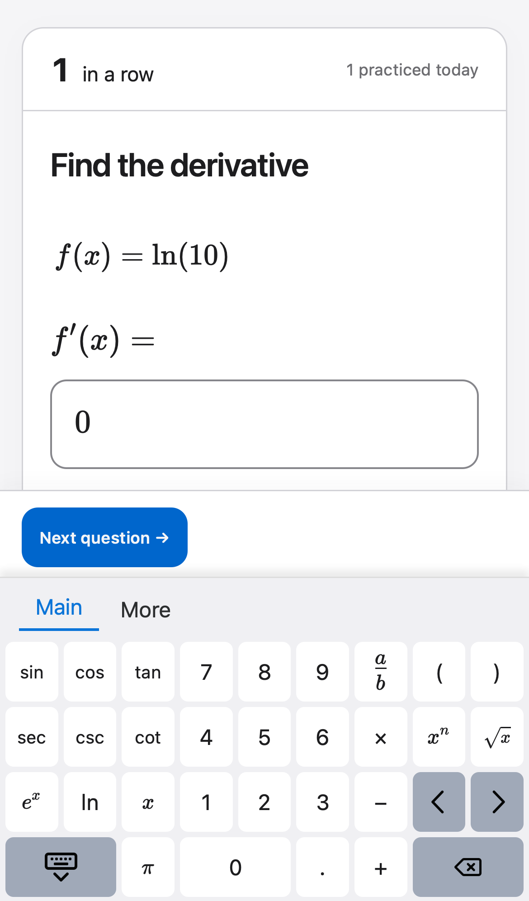
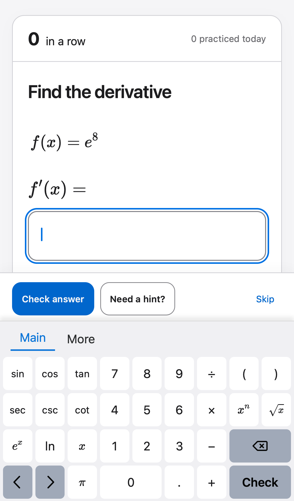
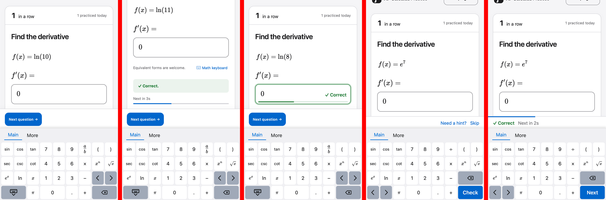
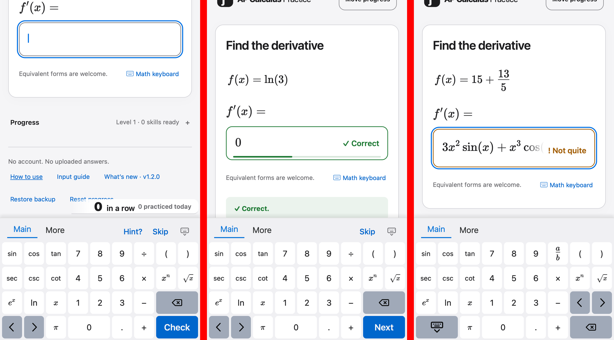

# 2026-09-26 键盘后续：答对提示被挡、键盘提交键、除号标签、图标居中

**性质**：调研与方案，尚未实施。用户在 iPhone 上试用 v1.2.0 预览版后提出四点，要求“先研究，给我方案”。v1.2.0 还没有发布到正式站点（仍在分支 `design-keyboard-1.2`），所以这些改动可以并入 1.2.0 一起发布。

用户原话：
1. 现在手机上打开键盘，会挡住 correct 提示和倒计时进度。能不能换个位置，加到输入框，或者重新排键盘展开时的 layout，哪个效果更好？你调研一下。
2. logo 的 “f′” 感觉不在方框中间。
3. 键盘能不能加个按键，提交答案和下一题放那里。能排开吗？比如把收起键盘挪走，左右键放那里，能不能腾出空间。
4. 分数线写除号吧，统一一点。

截图均为 WebKit iPhone 13 仿真（390 × 664 可视区域），实物 iPhone 上安全区等细节可能略有不同。调研用的样机是在运行中的页面里临时注入 CSS 和 JS 做的，没有改动仓库代码。

## 1. Research

### R1 · 答对后 “Correct.” 和倒计时被挡（事实）

- **复现**：手机上打开数学键盘作答，答对。键盘保持打开（这是既有设计：连续做题时键盘不收起）。
- **实测**：键盘顶部 y = 431，操作栏 y = 361–430，**可见内容区只有 y = 0–361**。答题框在 y = 280–346，可见；“Correct.” 反馈框在 y = 418–463，倒计时在 y = 475–501，都在操作栏和键盘后面，完全看不到。
- **原因**：上一轮 D-8 只处理了“答错 / 无效后答题框重新获得焦点”的情况；答对时焦点移到 Next 按钮，`keepAnswerVisible` 没有被调用。更根本的原因是：操作栏（69 px）加键盘（233 px）占去了屏幕的 45%，答题框下方已经没有空间了。

### R2 · 键盘加“检查 / 下一题”键（事实与可行性）

- **可以排开**。把“收起键盘”（2 格）从键盘上拿掉，← → 挪到底行左侧（2 格），原来 ← → 的位置（第 3 行第 8–9 列）放 ⌫（2 格），底行右侧（第 4 行第 8–9 列）放新的 **Check / Next** 键（2 格）。每行仍是 9 个单位；⌫ 在上、确认键在下，与 iOS 系统键盘的排法一致；More 页的 ⌫、← →、确认键位置与 Main 页相同。
- **实现方式（已在样机中验证）**：
  - MathLive 自带的 `commit` 命令会触发 app 已有的 Enter 逻辑，第一次按下能判分。但答对后焦点在 Next 按钮上，MathLive 没有可以发送命令的答题框，**第二次按下没有反应**。
  - 改为 app 自己监听这个键（事件委托）：没判分时调用 Check，答对后调用 Next。在样机中两步都成功，而且进入下一题后键盘保持打开。
- **按键文字**：判分前显示 “Check”，答对后显示 “Next”。直接改键帽文字即可，不必重设整个键盘布局（重设布局可能让页签跳回 Main）；这一点实施时需要再验证。
- **收起键盘放哪里**：拿掉按键后仍需要一个收起入口。候选：① 操作栏位置上新的状态条最右侧放一个 ⌄ 图标按钮；② 点键盘以外的区域收起；③ 叠加在键盘页签行的右侧（那里现在是空的，但要把按钮压在 MathLive 的元素上，比较脆弱）。页面里原有的 “Math keyboard” 开关一直都在。

### R3 · 三种解决 R1 的方案（样机对比）

从左到右：现状、方案 A、方案 B、方案 C 作答前、方案 C 答对后。

| | A · 滚动 | B · 结果显示在答题框里 | C · 确认键放进键盘，操作栏改为细状态条 |
|---|---|---|---|
| 做法 | 答对后像 D-8 一样把页面往上滚，让反馈和倒计时露出来 | 键盘打开时，答对的答题框变绿，框内右侧显示 “✓ Correct”，框底是倒计时细线；页面里的反馈框和倒计时暂时隐藏 | 键盘打开时，69 px 的操作栏换成 44 px 的状态条：作答前显示 “Need a hint? · Skip”，答对后显示 “✓ Correct · Next in 2s”，倒计时是状态条顶边的一条细线；Check / Next 放进键盘（R2） |
| 效果 | 能看到，但题目被滚出一部分，每题都要跳动一次 | 不滚动，题目和答案都在；结果就在视线所在的答题框上 | 不滚动；题目、答题框、结果、下一步都在拇指附近；多出约 25 px 内容空间 |
| 与第 3 点（键盘加确认键）的关系 | 无关，两件事要分开做 | 无关；键盘加确认键后，操作栏里的 Check answer 就重复了 | 本身就包含第 3 点：主按钮挪进键盘，操作栏自然变薄 |
| 答错时 | 与现在相同（D-8 已处理） | 答题框变橙色并显示 “! Not quite”；完整提示文字仍在下方（沿用 D-8 滚动） | 状态条显示 “! Not quite”；完整提示文字仍在下方（沿用 D-8 滚动） |
| 改动量 | 小（`keepAnswerVisible` 加一种情况） | 中（答题框的状态样式、倒计时移位） | 较大（键盘布局、状态条组件、收起入口、测试） |
| 风险 | 低 | 答题框里的公式很长时，“✓ Correct” 可能压到公式上 | 键盘打开时和收起时的操作区不一样，需要在 DESIGN.md 里写清楚两种形态 |

**推断**：
- C 同时解决第 1、3 点，结构最干净：键盘打开时，“下一步”永远在键盘右下角，与手机系统键盘的回车键位置相同。
- B 可以作为 C 的补充：C 的状态条已经显示结果，答题框再轻微变色可以强化反馈，但不是必需的。
- A 只治标，而且每题都会滚动。

### R4 · 图标 “f′” 不居中（事实）

- **实测**：图标是文字 “ƒ′”，用系统字体在 31 / 37 px 的方块里按文字框居中。墨迹上方留白约是下方的两倍，整体比中心低约 6%（约 2 px）；水平方向偏左约 1.5%，基本可以忽略。
- **原因**：字体里 “ƒ” 的下伸部分很长，而居中依据的是文字框，不是可见字形。在 Windows / Android 上，系统字体的 “ƒ” 形状不同，偏差也会不同。
- 仓库里没有 favicon 或 SVG 图标。

### R5 · 分式键改为 ÷（事实）

- 分式键现在显示 a/b 的上下结构，运算列的另外三个键是 ×、−、+，风格不一致。改成 ÷ 只改标签，按下后**仍然插入上下分式**（在 MathLive 里输入 “/” 本来就生成分式），读屏名称保持 “fraction”。见 R2 样机截图第 1 行第 7 列。

### 用户决定（2026-09-26）

1. “我觉得用 B 方案好，但是答案太长了会重叠。可以给输入框右边加一个白色底，衬出正确 / 不正确文字，这个底在文字左边较快渐变到透明那种效果，露出输入的答案。感觉比较高级。”→ **方案 B**，状态文字下垫一层底色，底色向左快速渐变为透明。
2. “main、more 这一条还能多放点东西，右边可以放收起键盘 icon、hint 和 skip 两个按钮？”→ **收起键盘、Need a hint?、Skip 放进键盘页签行右侧**。这样键盘打开时，键盘上方原来的操作栏就不再需要，可以整条去掉，多出约 69 px。
3. “蓝色按钮，显示文字”→ **确认键为主色蓝底，显示 Check / Next**。
4. “按推荐”→ **图标重画为 SVG**，并用它做 favicon。

### R6 · 在页签行放按钮的可行性（样机已验证）

- **位置**：关闭编辑工具栏后，MathLive 仍在每页页签行右侧保留一个空的 `.ML__edit-toolbar` 容器，并在它上面对 pointerdown 调用 `preventDefault`（`mathlive.mjs:28272`）。所以放在这里的按钮不会抢走答题框的焦点，样机中点按后焦点仍在答题框上。
- **事件**：在 WebKit 触屏仿真下，这些按钮收不到 `click`（MathLive 阻止了 pointerdown 的默认行为），只能监听 `pointerup`。确认键同样使用 `pointerup` 委托。
- **重建**：MathLive 每次设置布局（每道新题）或重新显示键盘时都会重建整块键盘 DOM，按钮会消失。实施时需要在重建后自动补回按钮（例如对键盘根节点用 `MutationObserver`）。
- **额外发现（R7，事实）**：手机上点 Need a hint? 或 Skip 后，数学键盘会关闭；Check / Next 不会，因为它们在完成后重新调用了 `show()`。在 D-8 的提交 `adec1eb` 上同样复现，所以不是本轮引入的；D-8 当时测到提示后键盘仍打开，说明结果受时序影响、不稳定。按钮放进键盘后，点 Hint? / Skip 键盘必须保持打开。
- **额外发现（样机问题，实施时避免）**：样机里用的类名 `practice-status` 与页面上连对统计栏已有的类名相同，导致统计栏被错误定位；实施时状态标签要用别的类名。操作栏去掉后，`body.keyboard-open` 为操作栏预留的 80 px 底部空间也要相应减少。

样机截图（WebKit iPhone 13，从左到右：作答前、答对、长答案答错）：

说明：第 1、2 张里页面滚动位置和统计栏位置不对，是上面说的样机问题；第 3 张的键盘又变回了旧布局，因为新题目重置了键盘，而样机没有改 app 的布局代码。

### R8 · 实施 F-2 时的新发现（事后补记：本节在部分修复尝试之后才写，顺序见下）

**真实顺序**：F-2 实现后浏览器实测，发现换题时控制台报错。之后我没有先记录，就连续试了三种修法（在捕获阶段处理键盘按钮，焦点在答题框上时不设只读，换题前先 blur 答题框），都没有解决。用户问起流程后，才补写本节。

**事实（实测与源码）**
1. **Hint / Skip 会关键盘（R7）的真正原因**：判分、提示、换题期间，`updateControls()` 会把答题框设为只读。MathLive 规定：答题框有焦点且键盘打开时，一旦被设为只读，就执行 `hideVirtualKeyboard` 收起键盘（`mathlive.mjs` 的 `readOnly` 分支，约 39507 行），并在下一帧更新键盘。Check 之后 app 会重新 `show()`，所以看不出来；Hint 和 Skip 之后没有重新打开，键盘就关了。
2. **MathLive 有自己的“当前输入框”标记**（`blurred`），只有在浏览器焦点真正移到另一个元素时才会被清掉。MathLive 自己的 `blur()` 在让答题框失焦前先把 `blurInProgress` 设为真，于是它自己的失焦处理直接跳过（`mathlive.mjs` 约 33329 行与 33303 行），标记保持“已聚焦”。实测：调用 `blur()` 后浏览器焦点已经到了 BODY，但 MathLive 仍认为答题框在输入。
3. **旧流程为什么没问题**：答对后，app 把焦点移到页面上可见的 Next 按钮，这是一次真实的焦点转移，MathLive 的标记被正常清掉。实测：旧代码答对后，`hasFocus()` 为 false，换题不报错。
4. **新流程为什么出错**：键盘打开时，我把操作栏设成了 `display: none`，Next 按钮无法获得焦点，`focus()` 什么也没做，焦点留在答题框里，MathLive 标记仍为“已聚焦”。按键盘上的 Next 换题时，旧答题框被整体删除；新答题框获得焦点时，MathLive 先去让“上一个已聚焦的答题框”失焦，而那个答题框已经被删除，于是报 `this.mathfield.options` 未定义，新答题框也没拿到焦点。
5. 在“最后一题按 Skip”的场景下还有同类的第二条路径：答题框被设为只读、触发了收起键盘，MathLive 预定下一帧更新键盘，而此时答题框已经被删除。

**推断**：只要让焦点在换题前真正离开答题框、落到一个真实可聚焦的元素上，MathLive 的标记就会正常清除（与旧流程相同）。做法：键盘打开时不把操作栏设为 `display: none`，而是和反馈框一样“视觉隐藏”（元素仍在页面中、可以获得焦点、读屏软件也能读到）。这样答对后焦点照旧移到 Next 按钮。这个思路是用户提出的，与第 3 条事实一致。

## 2. Spec（按用户决定定稿）

课程、判分、进度数据都不变。以下均为 v1.2.0 发布前的修改。

- **K8 · 键盘确认键**（修改 K1）：两页第 4 行第 8–9 列为确认键（2 格，`--tint` 底、白字、半粗体）：判分前显示 “Check”，答对后显示 “Next”；按下与在答题框按 Enter 相同（判分，或答对后进入下一题），不论焦点在哪里都有效。⌫ 移到第 3 行第 8–9 列；← → 移到第 4 行第 1–2 列；键盘上不再有收起键。每行仍是 9 个单位；← → ⌫ 和确认键在两页位置相同。读屏名称：“check answer” / “next question”。验收：布局单元测试；浏览器测试依次按确认键判分、进入下一题，键盘始终打开。
- **K9 · 页签行右侧的按钮**：两页页签行右侧依次为 “Hint?”、“Skip” 两个文字按钮（`--tint` 文字）和一个收起键盘图标按钮（读屏名称 “Hide keyboard”），高度 ≥ 40 px。Hint? 与页面上的 Need a hint? 效果相同（第 2、3 次点击依次显示下一条提示和完整解析，文字保持 “Hint?”）；提示用完时 Hint? 隐藏；答对后 Hint? 与 Skip 都隐藏，只留收起图标。点 Hint? 或 Skip 后键盘保持打开（修正 R7）。键盘重建后按钮自动补回。验收：浏览器测试依次点 Hint?、Skip、收起图标，检查结果、焦点仍在答题框、键盘开关状态。
- **K10 · 分式键标签**：显示 “÷”，按下仍插入分式，读屏名称仍为 “fraction”。
- **D9 · 键盘打开时的结果显示**（修改 D1、D8）：手机上键盘打开时，隐藏键盘上方原来的操作栏；页面为操作栏预留的底部空间改为只留键盘高度加 16 px。判分结果显示在答题框里：
  - 答对：边框 `--success`，框内右侧显示 “✓ Correct”，框底有一条 3 px 的倒计时线；
  - 答错：边框 `--warning`，显示 “! Not quite”；
  - 无效或无法判定：边框 `--control-border`，显示 “i Couldn’t check”。
  状态文字下方垫一层 `--surface` 底色，从文字左侧约 36 px 处快速渐变为透明，长答案的末尾因此淡出，但仍可见。页面里原来的反馈框和倒计时在键盘打开时隐藏（完整提示文字仍在 hint 面板里）。键盘收起时（包括桌面），操作区和反馈框与现在完全相同。多个答题框时，每个框按各自结果显示；分量没有单独结果时，只在第一个框显示。验收：390 px 下作答前、答对、答错、长答案答错的截图；浏览器测试断言答对后状态文字和倒计时线在键盘上方可见，且页面不需要滚动。
- **D10 · 图标**：“f′” 改为内联 SVG，按可见字形在方块中居中（偏差 ≤ 0.5 px），各平台一致；同一图形另存为 favicon（`public/favicon.svg`），并在 `index.html` 与 `help.html` 中引用。验收：放大截图画中心线检查；几何测试比较字形包围盒与方块中心。
- **文档**：DESIGN.md 第 5、6 节（键盘两种形态、确认键、页签行按钮、答题框内的结果显示），README，`help.html`，What's new 1.2.0 条目（尚未发布，直接修改）。

## 3. To Do

负责人：代码可以委派，文档由 Claude 写。`src/main.ts` 这一轮集中由 Claude 修改，避免多人同时改同一个文件。

- [x] **F-1 · K8/K10 · Astra medium**（布局数据；需要读 MathLive 源码确认 2 格确认键的写法，以及“不带命令的按键”该怎么写）— `src/math-keyboard.ts` 两页新布局（确认键带 `practice-enter` 类、收起键移除、⌫ 与 ← → 换位、÷ 标签）；`tests/math-keyboard-layout.test.ts` 同步更新。验证：vitest、tsc。 **结果（补记：合并时漏勾，用户询问后补上）**：Astra medium 实施，Claude 复核并合并（`5aaad62`）。Astra 发现 MathLive 中没有命令的按键会把自己的标签当文字输入（`mathlive.mjs:28850–28854`），所以给确认键设了一个空插入命令 `insert "" insertAfter`，按下不改变答案。Vitest 24 个文件 360 项通过，其中布局测试 34 项。
- [x] **F-2 · K8/K9/D9 · Claude**（跨模块的交互逻辑和视觉细节，需要在浏览器里反复调试）— `src/main.ts`：确认键与页签行按钮的 `pointerup` 委托、按钮自动补回、Check / Next 文字切换、Hint / Skip 后保持键盘打开、答题框内的结果显示与倒计时；`src/style.css`：键盘打开时隐藏操作栏、底部留白、答题框状态、渐变底、页签行按钮样式。 **结果**（提交 `3e23463`）：WebKit iPhone 13 仿真下，完整流程连续跑 5 次（浅色）加 1 次（深色），全部没有页面错误。流程为：作答前 → 长答案答错（答题框内显示 “! Not quite”，改答案后标签清除）→ 答对（答题框内显示 “✓ Correct” 和倒计时线，y ≈ 309 < 键盘顶 431，不需要滚动；确认键变为 Next，只剩收起按钮）→ 按键盘上的 Next 进入下一题（键盘保持打开，焦点在新答题框）→ Hint?（提示显示，键盘保持打开，焦点仍在答题框）→ 收起 → 从 “Math keyboard” 重新打开 → Skip。截图：`f2-compare.png`。
  - 实施中的问题与修正（详见 R8）：① 键盘里的按钮在触屏上收不到 `click`，改为在捕获阶段处理 pointerdown / pointerup，并自己绘制按下状态；② 答题框有焦点且键盘打开时不再设为只读，编辑改由 `beforeinput` 拦截（修正 R7，并消除“最后一题按 Skip”的报错）；③ 操作栏由 `display: none` 改为视觉隐藏，换题前焦点先移到 Next（采用用户提出的思路），消除了换题报错。中间有一种无效的尝试（先聚焦再 blur），已删除。
- [x] **F-3 · D10 · Claude**（设计：字形绘制与光学居中）— SVG 图标替换 `src/main.ts` 中的 `icon`（及 `help.html` 中的同款图标）；`public/favicon.svg`；`index.html` / `help.html` 的 `<link rel="icon">`。 **结果**（提交 `deb0af1`）：用路径画出斜体 f 与撇号，按字形的可见包围盒居中；在 app 中实测字形中心偏差：WebKit 390 px 为 0 px（主页和帮助页），Chromium 1280 px 深色为 0.33 px。新增 `public/favicon.svg`，`index.html` 与 `help.html` 都引用它。截图：`logo-after.png`。
- [x] **F-4 · K8/K9/D9/D10 · Luna max**（浏览器测试改写，范围明确，在 F-1 到 F-3 完成之后）— `tests/app.spec.ts`、`tests/visual-tokens.spec.ts`：确认键两步、页签行按钮、键盘打开时的答题框结果、图标居中；Claude 运行。 **结果**（Luna max 编写，提交 `8eb2966`；Claude 复核）：更新了因新设计失败的 4 个测试，新增 4 个测试（答题框内结果、页签行按钮、确认键两步、图标居中与 favicon），流程测试中检查没有 `pageerror`。被删除的断言都属于旧设计（操作栏、键盘上的收起键、4 个图标），均有对应的新断言。
- [x] **F-5 · 复核 · Claude** — 读 diff；运行全部测试；新测试放到旧代码上确认会失败。 **结果**：Vitest 24 个文件 360 项通过；数学核验 10,100 条、0 失败；构建成功；Playwright 三引擎 165 项通过、48 项按设计跳过、0 失败（退出码 0）。反向验证：把 `src/main.ts` 与 `src/style.css` 换回 F-2 之前的版本，4 个新测试全部失败。复核中发现 1 个测试场景问题：这个配置下只有两道题可做，测试在第二题按 Skip 结束了这一轮，结束时收起键盘是正确行为。已把 Skip 移到第一题（提交 `5739538`）。排查时我先误判为产品问题，加了一段“等一帧再打开键盘”的代码，查明原因后已撤回，没有提交。
- [x] **F-6 · 文档 · Claude** — DESIGN.md、README、`help.html`、`src/whats-new.ts` 的 1.2.0 条目。 **结果**（Claude 撰写，提交 `ddf2f07`）：DESIGN.md 更新第 5.3 节（手机上键盘打开时的形态）、第 6.1 节布局表与规则（确认键、页签行按钮、÷、键盘上没有收起键）、6.3、6.4 读屏名称、6.5 MathLive 焦点记录的注意事项，删除已不用的 `--shadow-bar`、`--dur-chrome`；`review-workflow.md` 的清单项；README 的“学生操作”和“数学键盘”两段；`help.html` 的 Correct 一条和 Typing formulas；What's new 1.2.0 改为 5 条。检索确认 README 与 help 中没有 Derivatives、hide keys 等旧说法。What's new 单元测试 6 项通过。另：从样式表删除已不用的 `--dur-chrome` 与减少动态模式里针对旧操作栏的规则（单独提交，属于 F-2 的收尾）。
- [ ] **F-7 · 常规设计审核 · Claude** — 按 `review-workflow.md` 做常规审核：键盘两页、作答前 / 答对 / 答错 / 长答案、提示、页眉图标，390 浅色 / 深色与 1280。
- [ ] **F-8 · 发布 · Claude + 用户** — 重新部署预览；用户在 iPhone 上确认；然后合并到 `main`、推送、部署正式站点，确认线上 `/` 和 `/help` 已是新版（接续上一份计划的 K-8 与 R-4）。

### Spec → To Do 覆盖

| Spec | 实现 | 验证 |
|---|---|---|
| K8 | F-1、F-2 | F-1 单元测试、F-4、F-7 |
| K9 | F-2 | F-4、F-7 |
| K10 | F-1 | F-1 单元测试、F-7 |
| D9 | F-2 | F-4、F-7 |
| D10 | F-3 | F-4、F-7 |
| 文档 | F-6 | F-7 |
