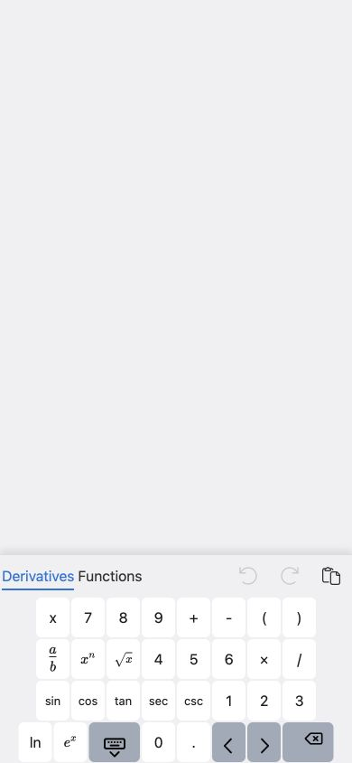
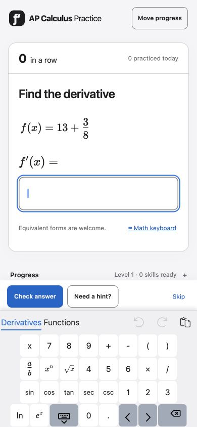
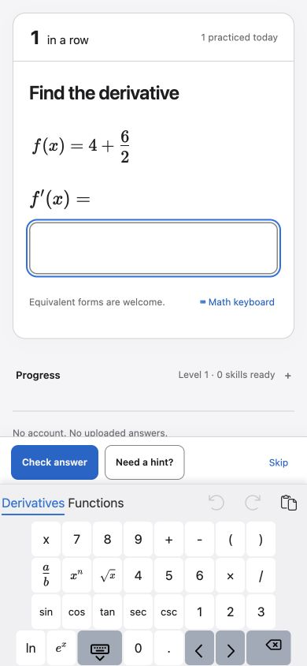

# 2026-09-26 发布审查、Spec 与修复记录

**记录性质：事后补记，不是事前计划。** 原始候选为 `ba035b0`，基线为 `b25bb34`。本次问题已经在 `c14b709` 修复、推送并部署后，补写本记录。用户随后明确要求：今后必须先完整记录问题（视觉问题附截图），再判断 Spec 变更，写出带 To Do 的计划与验收对应关系，然后才开始实施。本次不将已完成的工作伪装成事前审批或事前计划。

## 第一部分：发现的全部问题与证据

### F1 · P2 · 数学键盘打开后遮住题目与操作按钮

- 范围：`src/style.css` 的 `.ML__keyboard`；手机 390×844 普通视口直接复现。修复前的自动化截图也出现相同现象。
- 触发：进入练习，点击 Math keyboard。
- 实际：底部键盘可见，但上方题目、输入框、Check answer 等按钮被空白背景遮住。
- 预期：键盘打开时仍能看到并使用当前输入框与提交按钮；题目可正常查看。
- 根因：MathLive 的键盘根容器覆盖整个视口；新增的 `background: var(--fill)` 为整个根容器绘制不透明背景。控件的几何位置和点击路径仍可能正确，因此原有几何断言未捕获视觉遮挡。
- 判定：已确认的本次回归，阻塞发布；不是整页截图伪影。
- 处理：只删除根容器的背景声明，保留 `--keyboard-background` 为底部键盘面板配色。未改动键盘逻辑、课程规则或进度数据。

修复前（本次生产构建，普通视口截图）：

修复后（同一浏览器、相同视口与当前题）：

### F2 · 文档中的当前版本、测试数量与发布状态过时

- `README.md` 将生成器写成 `1.2.0`，测试 corpus 写成 5,200；本轮代码为 `2.0.0`，实际 corpus 为 101 个模板 × 100 种子 = 10,100。
- `docs/acceptance.md` 的汇总仍使用早期课程门槛、81 项浏览器测试等数值；“当前测试结果”实际是历史结果。还同时保留了“尚未部署/登录过期”与已上线记录，存在状态冲突。
- 影响：读者可能把旧版本证据误当成本次验证或当前线上状态。
- 处理：更正当前描述，将旧测试结果明确标为历史，新增本轮执行结果和证据边界。历史测试记录未伪造为重新执行。

### F3 · 非产品缺陷：开发模式测试误指向生产 preview

- 一次定向测试复用了生产 preview 服务；现有深色主题断言要求 token 文本精确等于 `#000000`，生产 CSS 压缩为 `#000`，导致两项失败。
- 两种表示的计算背景均为黑色；失败点不是主题颜色或键盘修复行为。
- 处理：恢复 Playwright 配置要求的开发服务后重跑，6 项全部通过；生产构建另外以普通视口实际检查。没有修改既有 token 断言来掩盖失败。

### 审查结论与未验证边界

- Luna Max 分别完成迁移/存储/传输、课程/调度/生成/判分、UI 代码的限定只读审查，没有其他确认的新增 P0–P2。
- 视觉审查发现 F1；修复后检查 390/1280px、light/dark 键盘态及生产普通视口，关闭该问题。此前通过的欢迎页、常规题、导入预览等未变范围复用本轮检查结果。
- 真机 iPhone/Android 安全区、系统键盘切换和物理摄像头仍未验证。既有 UI 审查中的标题层级、页脚对齐、庆祝频率建议不是本次新增阻塞项，未顺手修改。
- 有限数值核验不是任意表达式的形式证明，浏览器模拟也不代替真机验收。

## 第二部分：是否调整或新增 Spec

不改变课程、Basic/Mixed 通过规则、FSRS 调度、旧进度迁移规则或数据格式。本次只把既有“键盘打开仍可答题”的要求明确为可验收条件，并同步证据记录要求。

| 编号 | 性质 | 明确后的验收条件 | 与问题的关系 |
|---|---|---|---|
| K1 | 补充既有键盘可用性验收 | 键盘打开时，覆盖全视口的根容器保持透明；仅底部键盘面板绘制背景 | 排除 F1 的已确认根因 |
| K2 | 补充视觉验收 | 390px/1280px、light/dark 的实际渲染可见题目与当前输入区；手机 Check answer 操作栏可见且位于键盘上方，按键不裁切 | 防止只凭 DOM 几何判断通过 |
| K3 | 保留既有交互契约 | 键盘可以收起与再次打开，输入和判分仍正常；多输入题当前输入框不被操作栏遮挡 | 防止修复引入交互回归 |
| D1 | 补充证据记录契约 | 当前版本和测试数与本次执行一致；历史、复用、未验证、线上状态明确区分 | 解决 F2，解释 F3 |

**今后的执行顺序：** 先更新第一部分的问题与截图；再在本部分判断是否需要改/新增 Spec；接着写第三部分的 To Do 与验收映射。完成这三个步骤后才改代码。每完成一项 To Do，立即在本文将 `- [ ]` 改为 `- [x]` 并补上验证依据；不等整轮结束后统一回填。执行失败或证据不足的项目保持未勾选。若新发现改变范围或验收条件，先修订文档再继续。不因为写文档而额外增加未经要求的人工审批。

## 第三部分：修改计划、To Do 与完成条件

以下 A–C 是对已经实施工作的如实回填；不是修复前制定的计划。D 为本记录建立时尚需完成的发布核验。

### 计划 A：以最小样式变更关闭 F1

- [x] 用普通视口复现，保存修复前截图，并确认实际键盘根容器为 390×844、底部面板约 231px 高。
- [x] 删除 `.ML__keyboard` 的单条根背景声明，保留现有设计 token 与键盘面板配色。
- [x] 在现有明暗主题/两种宽度测试中新增根容器透明断言与键盘态截图。
- [x] 重新构建，并用生产构建保存相同视口的修复后截图。

完成依据：代码提交 `c14b709`；本目录 before/after 截图。对应 K1。

### 计划 B：验证视觉与交互，按修改影响面复验

- [x] 运行 6 项定向浏览器检查：4 种主题/宽度组合、手机键盘收放与判分、多视口/多输入题。
- [x] 运行 2 项 token 对比度测试，确认保留的设计配色满足现有断言。
- [x] Luna Max 打开修复后的 4 张键盘矩阵截图、2 张既有键盘路径截图及生产普通视口截图；确认 F1 已关闭。
- [x] 对最终 UI 代码做独立限定审查；无其他确认的 P0–P2。
- [x] 记录复用边界：本轮改 CSS 前已通过 320 项单测、10,100 道数学核验、三引擎 111 通过/24 设计跳过；随后没有修改迁移、生成或调度逻辑，不重复声称这些已全量再跑。

完成依据：6 项定向通过，2 项对比度通过；本轮截图与审查结果。对应 K1、K2、K3。

### 计划 C：同步文档，避免混淆证据

- [x] 更正 README 的生成器版本与 corpus 数量。
- [x] 更正 acceptance 汇总，保留历史结果并加上历史标记，移除相互冲突的当前登录/发布状态说法。
- [x] 记录 preview/开发模式测试环境差异、失败原因与重跑结果。
- [x] 新增本记录，保留截图并明确“事后补记”；写入今后先文档、后实施的顺序。

完成依据：`README.md`、`docs/acceptance.md` 与本文件。对应 D1。

### 计划 D：核对已授权的推送与上线

- [x] 将经过审查和验证的运行时修复 `c14b709` 推送至 `origin/main`。
- [x] 将同一构建部署至 Cloudflare Pages；部署地址为 `https://912748f2.ap-calculus-practice.pages.dev`。
- [x] 比对正式域名的页面与关键静态资源：8 个文件 SHA-256 全部匹配本地构建，部署来源为 `c14b709`。
- [x] 正式域名页面正常加载；在同次生产部署的独立地址完成输入/判分与手机键盘 smoke check，避免给正式域名已有本机进度添加测试作答。答案 0 被接受，连对与今日计数升至 1，自动进入下一题，键盘与提交按钮保持可见；控制台无 error/warn。
- [ ] 读取该运行时代码提交的远端 CI 最终结果，区分成功、失败或仍在执行。
- [ ] 将本记录和截图提交、推送，确认工作区状态与记录完整。

若任一步失败：记录失败阶段与证据，先判断是否新增问题/Spec 变化，更新本文计划后再修复；不把未完成项勾为完成。

### To Do 与 Spec 的闭环判断

A 保证 K1 的根因修复；B 用实际视觉和交互证据确认 K2/K3，避免透明属性正确但用户仍无法答题；C 保证 D1；D 证明这些已验证结果确实交付到正式站点。**只有对应证据齐备、To Do 全部完成，才能宣布本次交付完成；不能单靠复选框数量或测试通过宣称 Spec 已实现。** 这里的完成范围不包含上述真机与物理摄像头待验项。

## 发布实测补充证据

- 运行时代码：`c14b709fab76a6815753b80fe54fd394a9aeecd4`。生产部署：`912748f2`。正式域名 `https://ap-calculus-practice.pages.dev/`。
- 正式域名的首页、help、practice-config、skill-examples、主脚本、Worker、共享脚本、CSS 共 8 文件与本地发布构建逐个 SHA-256 一致；清单见 `live-asset-check.json`。
- 一次 Python HTTP 客户端请求返回 403；随后常规 curl 获取成功并完成哈希比对，浏览器正常访问。不将单次客户端失败归因为站点或凭据故障。
- 以下为同次生产部署独立地址的测试作答完成后画面：1 in a row、1 practiced today，已自动进入下一题。

