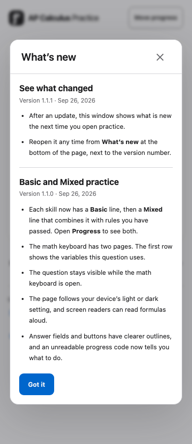
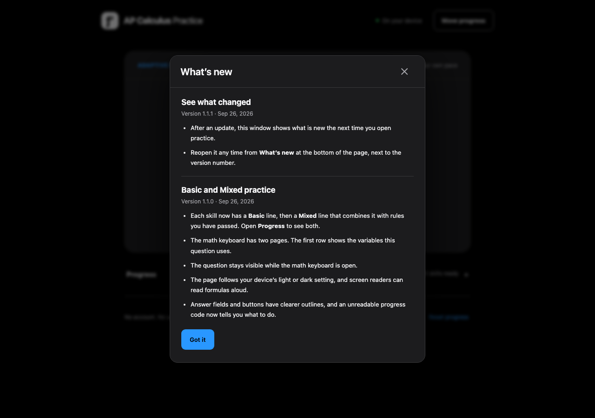
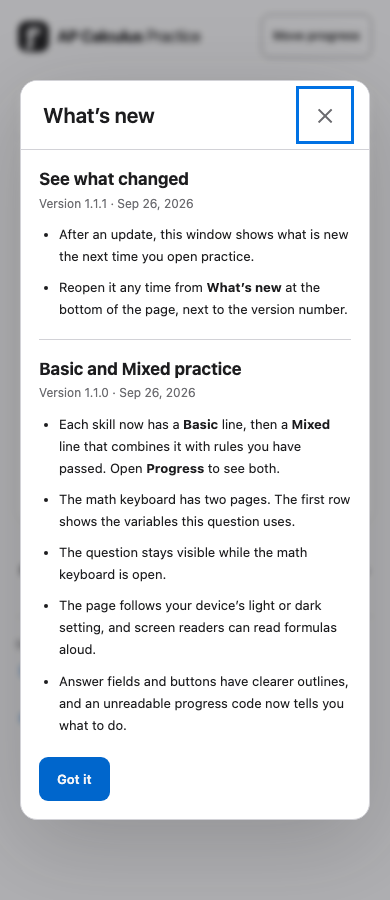

# 2026-09-26 更新后弹出 “What's new” 窗口

用户要求：每次更新之后，用户再次进入页面时弹出 What's new 窗口，提示有更新并介绍更新内容。用户要求先写本文件，确认后再实现。本文件在任何代码改动之前写入。

## Research

这是新功能，没有现存的界面缺陷，因此不附截图；实现后的 390/1280、浅/深色截图放在本目录（见 T6）。

- **R1 · 事实 · 新版本会在下次打开时到达用户。** 线上 `/` 的响应头为 `cache-control: public, max-age=0, must-revalidate`（2026-09-26 用 `curl -sI https://ap-calculus-practice.pages.dev/` 查看），`/assets/*` 带哈希且长期缓存（`public/_headers`）。所以部署后，学生下一次打开或刷新页面就会加载新代码；“再进入页面时”检测到新版本是可行的，不需要 Service Worker。项目没有 Service Worker。
- **R2 · 事实 · 目前没有任何“应用版本”概念可供比较。** `package.json` 的 `version` 固定为 `1.0.0`；`public/practice-config.json` 的 `revision` 是课程配置版本，不随界面更新变化；生成器版本 `2.0.0` 只描述题目生成。**推断：** 不能用已有字段判断“有没有更新”，需要一份随代码打包的更新记录，每条有稳定 ID。
- **R3 · 事实 · 进度存在 IndexedDB，且会被导出。** `src/storage.ts` 把 `AppState` 存在 `derivative-studio` 库；`AppState.progress` 会进入便携快照（`src/transfer.ts`），格式有版本与迁移（`src/migrate.ts`）。**推断：** “已读到哪条更新”不属于学习进度，放进 `AppState` 会牵动迁移和导出格式，代价与风险都不必要；放在 `localStorage` 的独立键里即可。项目当前没有使用 `localStorage`（grep `src/`、`tests/` 无结果）。
- **R4 · 事实 · 已有统一的弹窗。** `src/main.ts:533` 的 `modal(title, body)` 使用原生 `<dialog>` + `showModal()`，带标题、✕ 关闭、Esc 关闭，打开时隐藏数学键盘、取消自动下一题（`src/main.ts:534-535`）。Input guide、Move progress 都用它。自动下一题倒计时在有打开的 dialog 时停止（`src/main.ts:123`）。
- **R5 · 事实 · 启动时可能已经有别的弹窗。** 通过进度二维码链接（`#progress=`）打开且本机已有进度时，启动流程直接打开导入确认窗（`src/main.ts:903-913`）。两个弹窗同时出现会互相覆盖（`modal()` 只有一个 `#modal-root`）。
- **R6 · 事实 · 存储可能不可用。** IndexedDB 打不开时进入 temporary 模式（`src/main.ts:886-889`）；私密浏览或禁用站点数据时 `localStorage` 也可能抛错。**推断：** 如果读不到“已读”标记就每次都弹，会在每次加载时打扰学生。
- **R7 · 事实 · 页面文字只用英文。** 应用界面和 `help.html` 均为英文；上级 `../AGENTS.md` 规定 `help.html` 只用英文，且用户可见变化须同步 README 与 `help.html`。
- **R8 · 事实 · 可作为第一条更新记录的近期用户可见变化**（均为 2026-09-25/26 的提交）：每个技能分 Basic / Mixed 两条线（`c294d89`）；数学键盘两页、首行放当前题变量（`e045ae3`）；键盘打开时题目保持可见（`c14b709`）；跟随系统浅/深色（`49c0af7`）；读屏可朗读公式（`e045ae3`）；无法读取的进度代码给出直白提示（`fff90bd`）；输入框和次要按钮边界更清楚（`ba035b0`）。
- **R9 · 已决定（2026-09-26 用户确认）**：Q1–Q3 采用建议默认值；另外用户要求加上**版本号**：当前线上版本记为 `1.1.0`，本次改完为 `1.1.1`。
- **R11 · 事实（实现中发现，2026-09-26 记录）· MathLive 的聚焦是延迟的。** `node_modules/mathlive/mathlive.mjs:40191-40232`：`onFocus` 在 60 ms 后才真正聚焦，期间 `focusBlurInProgress` 为真，会忽略新的 focus/blur。T5(g) 最初在 WebKit 上连续失败，原因是测试在点 Start 后立刻点页脚按钮，落在这 60 ms 内；等输入框确实聚焦后再点，三引擎都通过。等 300 ms 后手动探测，三引擎关闭窗口后焦点都回到 `answer-0`。这是测试时序问题，不是产品缺陷，真实点击不会落在 60 ms 内。
- **R10 · 事实 · 版本号目前只在 `package.json`（`1.0.0`），界面不显示。** Vite 可以在构建时用 `define` 把 `package.json` 的版本注入代码（`vite.config.ts`，当前未使用 `define`）。**推断：** 以 `package.json` 为唯一来源、再用测试要求它与最新更新记录的版本相同，可以避免两处版本不一致。

## Spec

课程、判分、调度、进度格式、导出/导入格式均不变。以下为新增需求。

| 编号 | 性质 | 可观察行为与验收条件 |
|---|---|---|
| W1 | 新增（按 R9 修改） | 更新记录随代码打包在 `src/whats-new.ts`：按版本倒序的数组，每条以**版本号**为稳定 ID（`MAJOR.MINOR.PATCH`），另含显示日期、标题、2–6 条英文要点。只有用户可见的变化才发布新版本并新增一条；纯重构、测试、内部文档不改版本、不新增。 |
| W0 | 新增（R9） | 应用有版本号。`package.json` 的 `version` 是唯一来源，本次为 `1.1.1`；构建时注入为 `__APP_VERSION__`。单元测试要求它等于 `WHATS_NEW[0].version`。页脚显示当前版本（“What's new · v1.1.1”），What's new 窗口每条标出版本号与日期。 |
| W2 | 新增 | **老用户**（本机已有保存的进度）在打开页面时，如果存在比本机“已读”标记更新的条目，页面渲染完成后弹出标题为 “What's new” 的窗口，列出所有未读条目（新的在前）。窗口有 ✕、Esc 和一个 “Got it” 按钮关闭。 |
| W3 | 新增 | **新用户**（本机没有保存的进度）不弹窗；启动时直接把标记设为最新条目。通过二维码链接在新设备首次恢复进度同样不弹。 |
| W4 | 新增 | 弹窗一旦显示，立即把标记设为最新条目；之后刷新或再次进入都不再弹，直到下一次有新条目。 |
| W5 | 新增（实现前细化） | 以下情况本次加载不弹窗、也不改标记：URL 带 `#progress=` 且本机已有进度（导入确认窗优先，R5；本机无进度时按 W3 设为最新）；启动出错页面；`localStorage` 读写抛错（R6，宁可不弹也不反复弹）。 |
| W6 | 新增 | 页脚新增 “What's new” 文字按钮，随时打开同一窗口，显示全部条目（最新在前）。 |
| W7 | 新增 | 关闭窗口后，如果页面上有未完成的题目，焦点回到答案输入框；弹窗期间自动下一题不运行（沿用 R4 行为）。 |
| W8 | 新增 | 标记（已读到的版本号）存于 `localStorage` 键 `apcalc.whatsNewSeen`，不写入 IndexedDB 的 `AppState`，不进入导出快照，“Reset progress” 与 “Restore backup” 不影响它。 |
| W9 | 新增 | 窗口在 390px 与 1280px、浅色与深色下无横向溢出，文字不小于 12px（`tests/visual-tokens.spec.ts` 的规则），内容过长时窗口内部滚动。 |
| W10 | 新增（按 R9 修改） | 两条初始记录：`1.1.0`（2026-09-26）介绍 R8 中已上线的变化；`1.1.1`（上线日）介绍 What's new 窗口、版本号和页脚入口。现有学生没有标记，下次打开页面会一次看到这两条（新的在前）。未读判断按版本号大小比较；标记无法解析时视为没有标记。 |
| W11 | 文档 | README（中文）与 `help.html`（英文）说明 What's new 窗口何时出现、如何重新打开；`../AGENTS.md` 的“文档同步”一节增加一条：用户可见的变化须提升 `package.json` 版本号，并在 `src/whats-new.ts` 新增同版本条目。 |
| W12 | 交付 | 单元测试、构建、三引擎 e2e 通过；推送后 CI 成功；Cloudflare 部署后线上 `/` 与 `/help` 与本地 `dist` 哈希一致，并在线上用一个模拟“老用户”的干净浏览器确认弹窗出现一次。 |

### 需确认的决定（2026-09-26 已确认，见 R9）

- **Q1 新用户是否也弹？** 建议：不弹（W3）。第一次来的人还没见过旧版，“更新了什么”对他们没有意义。
- **Q2 什么算“一次更新”？** 建议：不是每次部署都弹，只有在 `src/whats-new.ts` 新增条目时才弹（W1）。否则修一个测试或文档也会打扰学生，而且没有可写的内容。
- **Q3 第一条记录的内容与时间。** 建议：以本功能上线日为 `id`，汇总 R8 的变化（W10），让现有学生在功能上线当天就看到一次。如果你不希望回顾这些已上线的变化，可以改成只写一句 “You can now see updates here.”。

## To Do

确认前每个 Spec 都有实现与验证项：W0→T0/T1；W1、W10→T1；W2–W5、W8→T2/T5；W6、W7→T3/T5；W9→T6；W11→T4；W12→T7/T8。

本功能涉及启动流程与焦点，改动集中在少数文件，由我直接实现，不委派 Luna。

- [x] **T0 · W0** — `package.json` 版本改为 `1.1.1`（`package-lock.json` 同步）；`vite.config.ts` 与 `vitest.config.ts` 用 `define` 注入 `__APP_VERSION__`，`src/` 中声明其类型。验证：T1 的测试要求 `__APP_VERSION__ === WHATS_NEW[0].version`；构建产物中出现 `1.1.1`。**结果：** `package.json`/锁文件根版本为 1.1.1；`src/env.d.ts` 声明类型；版本断言通过（T1）；`dist/assets/main-*.js` 含 `1.1.1`。
- [x] **T1 · W1/W10** — 新建 `src/whats-new.ts`：导出 `WHATS_NEW`（`1.1.1`、`1.1.0` 两条），以及纯函数 `compareVersions`、`unseenEntries(entries, seen)`。验证：新增 `tests/whats-new.test.ts`，覆盖版本唯一且严格倒序、版本等于 `package.json`、seen 为空/最新/较旧/无法解析/比最新还新时返回的未读条目。**结果：** `tests/whats-new.test.ts` 6/6 通过（2026-09-26 17:08），含 `__APP_VERSION__ === package.json === WHATS_NEW[0]` 的断言。
- [x] **T2 · W2–W5/W8** — `src/main.ts`：新增 `readSeen()`/`writeSeen()`（`try/catch` 包住 `localStorage`，出错返回“不可用”）；在 `boot()` 中按 W2–W5 决定是否弹窗，基于 `saved` 判断新老用户，`progressLink` 存在时跳过。验证：T5 的 e2e 用例。**结果：** `boot()` 中实现；新设备通过链接恢复时同样设为最新（W3/W5 细化）。T5 (a)(b)(c)(d)(e)(h) 通过。
- [x] **T3 · W2/W6/W7** — `src/main.ts`：`whatsNew(entries)` 用现有 `modal()` 渲染条目与 “Got it” 按钮；页脚加 “What's new · v{版本}” 按钮；条目显示版本号与日期；关闭时如有题目调用 `focusAnswer()`。`src/style.css` 只在需要时为条目列表加少量样式（沿用 tokens）。验证：T5、T6。**结果：** 页脚显示 “What’s new · v1.1.1”；条目带版本与日期；“Got it”/✕/Esc 关闭；关闭后焦点回到答案（T5(g)）。样式只用现有 tokens。
- [x] **T4 · W11** — `README.md`、`help.html`、`../AGENTS.md`：按 W11 更新；先对照代码核对两份文档中相关说法。验证：重读三处；`tests/ux-refresh.spec.ts` 通过。**结果：** README 学生操作一节新增 What's new 段、倒计时一句改为包含 What's new 窗口，部署一节前新增“版本与更新记录”维护规则；`help.html` 在 Your path 下新增 “Updates and version” 折叠段；`../AGENTS.md` 文档同步一节新增版本规则并补交付检查（该文件不在 git 中）。核对：README 其他说法与新行为无冲突。`ux-refresh.spec.ts` 三引擎 6/6 通过。
- [x] **T5 · W2–W8** — 新增 `tests/whats-new.spec.ts`（Playwright）：(a) 新用户首次打开不弹且标记为最新；(b) 预置 IndexedDB 进度、无标记 → 弹窗，关闭后刷新不再弹；(c) 标记为旧 id → 只列出更新的条目；(d) `#progress=` 链接不弹、不改标记；(e) `localStorage` 被禁用时不弹、页面正常；(f) 页脚按钮显示 `v1.1.1` 并打开全部条目；(g) 有题目时关闭后焦点回到输入框；(h) 导出快照不含标记（检查导出代码解码后的键）。验证：三引擎执行通过。**结果：** `tests/whats-new.spec.ts` 7 个用例；`--repeat-each=3` 三引擎共 63/63 通过。(g) 用页脚入口验证关闭后焦点（启动时弹窗走同一个关闭逻辑）；时序问题见 R11。另外，`tests/app.spec.ts`、`tests/flow.spec.ts` 的预置进度函数同时写入“已读”标记，避免旧用例被新窗口遮挡。
- [x] **T6 · W9** — 在 390 浅色与 1280 深色截图弹窗，保存到本目录 `whats-new-390-light.png`、`whats-new-1280-dark.png`，检查无溢出；`tests/visual-tokens.spec.ts` 加入该窗口的字号检查。验证：截图人工查看 + spec 通过。**结果：** `tests/visual-tokens.spec.ts` 新增 4 个用例（390/1280 × 浅/深），检查字号 ≥12px、窗口与页面横向溢出为 0、窗口在 900px 高度内完整显示；Chromium 10/10 通过。截图（页面：首页，状态：从页脚打开 What's new）：

   

  人工查看：两条记录、版本与日期、按钮都完整可见，无裁切。
- [x] **T7 · W12** — `npm test`、`npm run test:math`、`npm run build`、`npm run test:e2e`；提交并推送，等待 CI。验证：CI 成功，记录测试数。**结果：** 单元测试 23 个文件 326/326 通过；数学 corpus 10,100 题 0 失败；构建成功；e2e 三引擎 136 通过、32 项按设计仅 Chromium 运行而跳过、0 失败。`d4e6104` 已推送，CI run 36232461501 成功。
- [x] **T8 · W12** — `wrangler pages deploy dist`；比对线上 `/`、`/help` 与关键资源的 SHA-256；在干净浏览器预置老用户进度后打开线上站点，确认弹窗出现一次、刷新后不再出现。验证：哈希一致 + 线上截图。**结果：** Cloudflare 部署 `51e3b4b1`（来源 `d4e6104`）；正式域名 `/`、`/help` 与 4 个资源文件共 6 个与本地 `dist` SHA-256 一致；线上 `/help` 含 “Updates and version”。干净 Chromium 预置老用户进度后打开线上站点：弹窗出现、两条记录；点 Got it 后刷新不再弹出；页脚显示 “What’s new · v1.1.1”。线上截图（390 浅色，老用户首次打开）：

  

## Progress log

- `d4e6104` — What's new 窗口与版本号 1.1.1；单元测试 326 通过（新增 6），数学 10,100 题 0 失败，e2e 136 通过 / 32 跳过 / 0 失败（新增 `whats-new.spec.ts` 7 例 × 3 引擎，视觉 4 例）；CI 成功；Cloudflare 部署 `51e3b4b1`，线上 6 个文件哈希一致，线上老用户弹窗验证通过。

## 完成核对

- W0 → T0 + T1（版本断言）+ T8（线上页脚 v1.1.1）：满足。
- W1、W10 → T1（单测）+ T6 截图（两条记录内容）：满足。
- W2、W4 → T5(b) + T8 线上：满足。W3 → T5(a)；链接恢复新设备由 `progress-link.spec.ts` 原有用例覆盖弹窗不遮挡流程，且代码在无本地进度时写入标记：满足。
- W5 → T5(d)(e)：满足。启动出错页面不经过弹窗代码（错误发生在 `render()` 之前或进入 catch），未单独测试，属于代码检查结论。
- W6、W7 → T3 + T5(f)(g)：满足；(g) 通过页脚入口验证，启动弹窗共用同一关闭逻辑（R11）。
- W8 → T5(h)：满足。W9 → T6：满足。W11 → T4：满足。W12 → T7 + T8：满足。
