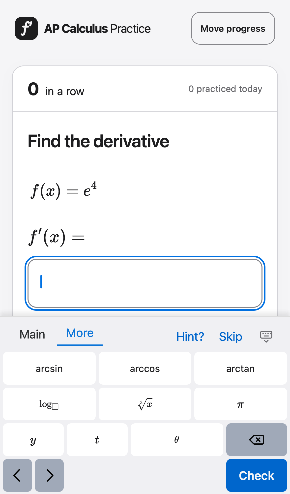
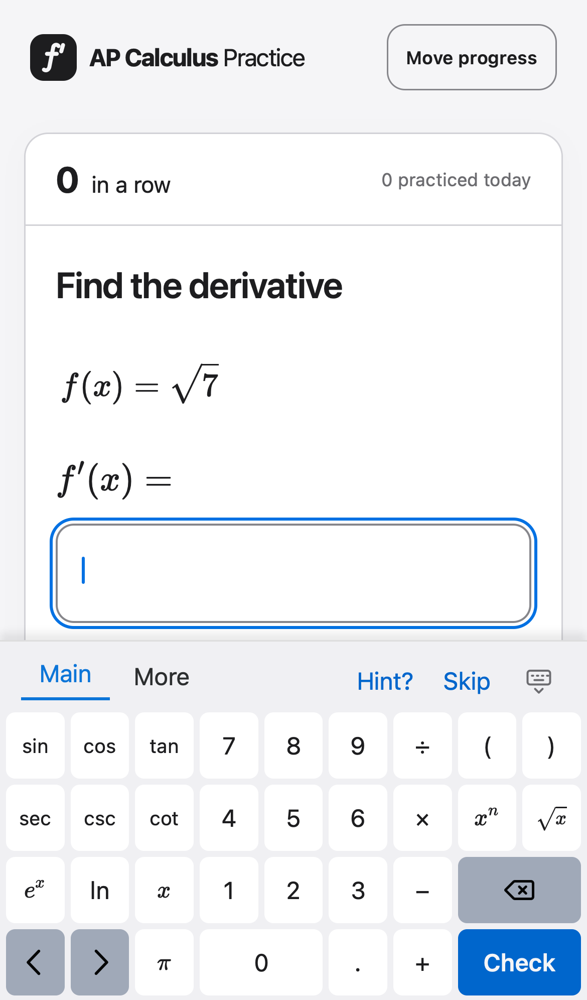
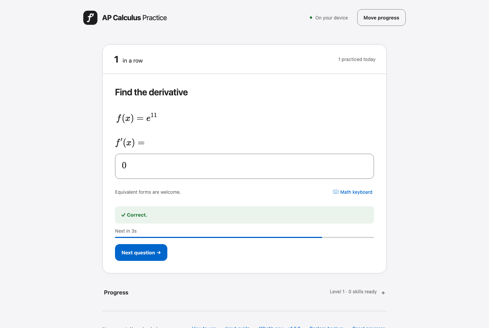

# 2026-09-27 键盘打磨：More 页排布、符号、字体、按键位置、桌面端结果显示

用户在第二个 v1.2.0 预览版（`ec8609e`）上提出六点，原话：

1. 现在键盘more这页的排布很难看，按钮大小不一样，pi是重复的
2. main这边乘号和x容易混，改成·吧。除号改成/；x^n别写n，留个框更好理解
3. 键盘的字体有serif有sans，是不是都用同一个数学字体，和题目一样的
4. 把常用的功能尽量放右手边？把pi去掉，左右括号放第三行左1左2，x、pi换成ex和ln；x和一个机动的放在现在括号的地方
5. 桌面端也把提交后的正确/错误提示和倒数进度放到答题框吧，和手机上一样
6. 文档写完给我讲讲再开工

## Grill (decision log)

Recon：读了 `src/math-keyboard.ts`（全部）、`src/main.ts` 的答题框结果、倒计时、键盘按键处理（55–172、345–410、590–700 行）、`src/style.css` 的答题框与键盘样式（600–670、1115–1200、1290–1350 行）、DESIGN.md 第 5.3、6 节、README 与 `help.html` 中键盘和判分的段落、`tests/math-keyboard-layout.test.ts`、上一份计划 `docs/reviews/2026-09-26-keyboard-followups/plan.md`，运行了 `scripts/key-usage.ts`。不需要问的事实：

- v1.2.0 还没有发布（F-8 在等 iPhone 确认，正式站点仍是旧版），所以这轮改动并入 1.2.0。
- 题目公式由 MathLive 的 `convertLatexToMarkup` 渲染，用的是 KaTeX 字体（衬线）；键盘上用 `label` 的键（数字、sin、+、( 等）是系统无衬线字体，用 `latex` 的键（x、π、eˣ、√、log▫）是 KaTeX 字体。这就是第 3 点看到的混用。
- 题库 4,040 题的答案里 π 出现 0 次；变量只有 x（3,400）、x 与 y（160）、t（320）、θ（160）。每道题只用自己的变量，所以 More 页的 y、t、θ 对作答没有用处（隐函数题的 y 已在 Main 页）。

Size class：medium，有六个相互独立的设计点，一轮问完，必要时再追问一轮。

| # | Question | Options (recommendation first) | Owner's answer | Date |
|---|---|---|---|---|
| G1 | 第 4 点的 Main 页排布是否这样理解（见 R3 表格） | **按 R3 表格**（`( )` 放第 3 行第 1–2 列，eˣ、ln 放原来 x、π 的位置，x 和机动键放原来括号的位置）/ 另有调整 | 待答 | 2026-09-27 |
| G2 | 机动键在非隐函数题显示什么（隐函数题显示 y） | **² （平方，一键输入 ^2）** / π / 留空（不可按的空位）/ 本题变量以外的其他符号 | 待答 | 2026-09-27 |
| G3 | “/” 键按下后是什么 | **仍插入上下分式，只是标签改为 /**（与在键盘上打 `/` 的效果一致）/ 输入一条斜线（行内 a/b） | 待答 | 2026-09-27 |
| G4 | More 页放什么、怎么排 | **只放 6 个键，统一 3 格宽：arcsin arccos arctan / log▫ ∛ π；去掉 y、t、θ**；第 3、4 行只留 ⌫、← →、Check / 保留 y、t、θ，但所有键改为和 Main 一样的 1 格宽 | 待答 | 2026-09-27 |
| G5 | 哪些键用数学字体 | **所有数学内容键（数字、运算符、括号、函数名、变量）都用题目的 KaTeX 字体；Check / Next 和页签行（Main、More、Hint?、Skip）保持界面字体** / 连 Check / Next 也用数学字体 | 待答 | 2026-09-27 |
| G6 | 桌面端（以及手机不开键盘时）结果怎么显示 | **所有情况都在答题框里显示结果和倒计时线；答对时去掉下方的 “Correct.” 框和 “Next in 3s” 条（读屏仍会读出）；答错 / 无法判定时，下方只保留说明句（如 “Check the rule and the inner derivative.”），不再重复 “Not quite”**；Next question 按钮保留 / 下方的反馈框全部去掉 / 下方反馈框照旧，只是多加框内显示 | 待答 | 2026-09-27 |

第 1 轮回答（2026-09-27，原话要点）：
- G1、G2：没有直接确认；提出 e 的指数、幂、根号的键帽应该用空框而不是 x，问 “x^框” 和 “框^框” 是否都要，机动键怎么设计。→ 转为 G7、G8。
- G3：“/ 对应分式吧。如果加长按，就是单按出除号，长按出分式。”→ 转为 G9。
- G4：“more 页保留一些变量吧，后面可以改变量名考察对求导含义的理解。”→ 否决推荐，转为 G10。
- G5：“没问题”。→ **定案：推荐方案。**
- G6：“都放框里吧，但是答错了 retry 的 flow 是什么样的？”→ 转为 G11。
- 新需求：长按改变按键含义，像 iOS 键盘那样，长按时弹气泡；“长按其他按键安排什么功能也可以想”。→ G12。

| # | Question | Options (recommendation first) | Owner's answer | Date |
|---|---|---|---|---|
| G7 | 键帽上的占位写法 | **凡是 “作用于前面内容” 或 “等你填” 的位置一律画空框：幂 ▫^▫、eˣ 改 e^▫、√▫、分式 ▫/▫（上下）；只有真的插入变量的键才写 x（如 x^▫）** / 维持现状 | 待答（loop-back） | 2026-09-27 |
| G8 | 机动键 | **非隐函数题为 [v]^▫（本题变量的幂，一键插入 x^▫）；隐函数题为 y，x^▫ 和 y^▫ 放在幂键的长按里** / ² / π | 待答（loop-back） | 2026-09-27 |
| G9 | 分式键单按与长按 | **单按上下分式，长按出 ÷**（理由见 R8）/ 单按 ÷，长按分式（负责人的提议） | 待答（loop-back） | 2026-09-27 |
| G10 | More 页排布（保留变量） | **两段：上两行函数，3 格宽（arcsin arccos arctan / log▫ ∛▫ \|▫\|）；下两行变量与常数，1 格宽，与 Main 同尺寸（x y z t u v w / θ r s π e）** / 全部 1 格宽 | 待答（loop-back） | 2026-09-27 |
| G11 | 答错后的流程与框内显示 | **框底加一条状态栏（在框线以内）：答对 “✓ Correct” + 倒计时线；答错 “! Not quite. ＜说明句＞”；无法判定 “i Couldn’t check. ＜原因＞”。答错后焦点留在框里，改答案时边框恢复、状态栏变灰但保留，下次 Check 时替换** / 维持右侧叠字，说明句只给读屏 / 右侧叠字 + 框下方说明句 | 待答（loop-back） | 2026-09-27 |
| G12 | 长按功能与提示 | **用 MathLive 自带的长按面板（按住 0.3 秒弹出，选项见 R7 表）；有长按的键在右上角画一个小角标；帮助页和 What's new 说明** / 不做长按 | 待答（loop-back） | 2026-09-27 |

第 2 轮回答（2026-09-27，原话要点）：
- G12 改为：“不用完全像 iOS 键盘那样，只有一个长按选项，就是长按弹出一个气泡提示变成了什么，然后松手就输入了，不需要滑过去。”→ **定案：每个键最多一个长按功能；按住弹出气泡显示将输入的内容，松手输入。**
- G9：“同意分式键反过来的设计。”→ 理解为 Claude 推荐的 “单按分式、长按 ÷”（与负责人最初的提议相反），在 G13 请负责人确认。
- 长按内容：“sin、cos、tan 长按是各自的 arc 就行”；“▫^▫ 和 √▫ 长按只留一个填入变量的单一选项”。→ **定案：sin/cos/tan → arcsin/arccos/arctan；▫^▫ → [v]^▫；√▫ → √[v]。** G7（空框占位）随之定案为推荐方案。
- G10 被取代：“more 页的键感觉可以完全去掉了，字母都放到数字的长按里……main/more 的标签都不用了，保留一个代表 shift 的上箭头按钮，点击它变激活，键盘切 alt，这时不用长按也能输入 alt 功能。”→ **定案：只有一页键盘；每个键的长按功能同时是它的 alt 功能；⇧ 键切换 alt 状态。** 细节见 G14–G17。

| # | Question | Options (recommendation first) | Owner's answer | Date |
|---|---|---|---|---|
| G13 | 确认分式键 | **单按上下分式，长按 / alt 为 ÷** / 单按 ÷，长按分式 | 待答（loop-back） | 2026-09-27 |
| G14 | 机动键（▫^▫ 的长按已经是 [v]^▫） | **普通题为 ▫²（平方），隐函数题为 y** / 普通题仍为 [v]^▫ / π | 待答（loop-back） | 2026-09-27 |
| G15 | ⇧ 的行为 | **点一次只对下一个键生效，然后自动恢复；连点两次锁定，再点一次解除（MathLive 自带，与手机键盘相同）** / 一直保持到再点一次 | 待答（loop-back） | 2026-09-27 |
| G16 | 键上是否印出 alt 内容 | **每个有 alt 的键右上角用小灰字印出 alt 内容（像计算器的第二功能），不另画角标；⇧ 激活时主字与小字对调，没有 alt 的键变淡** / 只画角标 / 不标 | 待答（loop-back） | 2026-09-27 |
| G17 | 字母与数字的对应 | **7 8 9 → x y z，4 5 6 → u v w，1 2 3 → r s t，0 → θ，. → π；e^▫ 的 alt 为常数 e** / 其他排法 | 待答（loop-back） | 2026-09-27 |

第 3 轮回答（2026-09-27，原话要点）：
- “sec/csc 的 alt 是他们的平方。”→ **定案：sec → sec²，csc → csc²。**
- G14 被取代：“把 ⇧ 放机动吧，顶栏左边 hint、skip，右边收键盘。”→ **定案：⇧ 占第 1 行第 9 列（原机动键位置），没有机动键；顶栏左侧 Hint?、Skip，右侧收起键盘。** R9 的 “⇧ 放顶栏” 路线作废，⇧ 用 MathLive 自带的 `[shift]` 键。
- G16：“印个小 alt 吧，但是给我看看再彻底改，我不确定手机上能不能看清。”→ **定案：印小 alt，先做样机给负责人看，确认后再做完整实现（To Do T1 为关卡）。**
- “其他没问题”→ **G11、G13（单按分式、alt 为 ÷）、G15、G17 定案为推荐方案。**

第 4 轮回答（2026-09-27，看过 alt 小字样机后，原话要点）：
- “显示 alt 太挤了太丑了，不显示了。”→ **定案：键上不印 alt。** G16 改判；alt 只在长按气泡和 ⇧ 激活时出现。
- “arcsin 那些太长了，还是显示 -1 但是输入 arc 吧。”→ **定案：⇧ 激活时三角键显示 sin⁻¹、cos⁻¹、tan⁻¹，输入 `\arcsin` 等**（判分器认 arcsin，不认 `\sin^{-1}`，R8）。
- “那个 shift 图标好丑。”→ **定案：重画 ⇧ 图标**（样机 2：细线空心箭头，线宽 1.6，与收起键盘图标一致；激活为实心并着色，锁定时箭头下加一横）。
- “还需要找之前的三个 design skill 快速过一遍（sonnet medium），这次改进还是挺大的。”→ **定案：实现前先做一次三视角快速评审（T1b）**，评审对象为样机 2；发布前的完整审核（P4）照旧。

第 5 轮（2026-09-27，负责人看到样机 2 的状态栏后更正，原话）：“这个 correct 显示怎么跟之前说的不一样？应该和手机显示一样在答题框里。打错的也一样，不用补那句小字的话。”
→ **定案：G11 改判。所有设备都用手机现在的框内显示**（答题框右侧 “✓ Correct” / “! Not quite” / “i Couldn’t check”，答对时框底倒计时线，边框变色），**不加框底状态栏，不显示说明句**。说明：G11 的推荐是框底状态栏，与手机现有的框内叠字不是同一个设计；第 3 轮 “其他没问题” 被 Claude 当作同意了状态栏，样机 2 因此画成了状态栏。更正后状态栏作废。

第 5 轮补充（2026-09-27，原话）：“⇧ 的三种状态样式参考 iOS 键盘的 shift 吧。”→ **定案：⇧ 三态照 iOS 键盘的 shift**：关 = 灰色功能键底、空心箭头；一次性 = 白色（普通键）底、实心箭头；锁定 = 白色底、实心箭头加下方横线。取代综合表中 A3 / B3 的 “浅蓝底” 改法。

| # | Question | Options (recommendation first) | Owner's answer | Date |
|---|---|---|---|---|
| G18 | 键上不印 alt，学生怎么发现长按和 ⇧（评审 A1、C-F1 定为 P1）；y 放在哪里 | **① y 同时作为 [v] 键和 8 的 alt（隐函数题最常用的 y 放在变量键上最好找，8 上保留是为了字母排列完整）；② 键盘第一次打开时，顶栏中间显示一行 “Hold a key or tap ⇧ for more”，第一次用过长按或 ⇧ 后不再显示（记在本机）；③ 帮助页与 What's new 说明** / 只靠帮助页和 What's new / 首次打开时弹一个说明气泡 | 待答（loop-back） | 2026-09-27 |
| G19 | “无法判定” 时是否显示原因（如 “Use only x and supported functions.”、括号不配对） | **显示：只在无法判定时，把原因放进框内右侧文字（“i Use only x”这类短句），不另加一行**；答错不显示说明句（负责人已定） / 同答错一样不显示原因 | 待答（loop-back） | 2026-09-27 |

第 6 轮回答（2026-09-27，原话）：
- “白底实心箭头是不是有点像其他按键？还能怎么区分？”→ 转为 G20，附对比样机。
- G18：“首次提示+文档吧”→ **定案：键盘第一次打开时顶栏中间显示一行提示，第一次用过长按或 ⇧ 后不再显示（记在本机）；帮助页与 What's new 说明。** 负责人没有选 “y 同时作为 [v] 键的 alt”，按默认处理为 **y 只在 8 的 alt 上**（D7 不变）。
- G19：“放在框下面或上面的小字吧，就像密码输入错误那样样式”→ **定案：无法判定时，答题框下方显示一行小字说明原因，样式同表单校验错误**（见 G21 的细节）；框内右侧仍显示 “i Couldn’t check”。

| # | Question | Options (recommendation first) | Owner's answer | Date |
|---|---|---|---|---|
| G20 | ⇧ 激活时如何与普通白键区分 | **B：照 iOS 的形状（关 = 灰底空心，一次性 = 白底实心，锁定 = 白底实心加横线），但激活时箭头用 `--tint` 蓝色，与 ⇧ 状态下变蓝的 alt 字一致（“蓝 = alt 状态”）** / A：完全照 iOS，黑色实心箭头 / C：激活时蓝底白箭头（与 Check 键撞色，违反 “一个状态一个主按钮”） | 待答（loop-back），样机 `proto3-shift-*.png` | 2026-09-27 |
| G21 | 无法判定的小字：位置与颜色 | **框下方（表单校验错误的通行位置），小字号（`--t-footnote`），颜色 `--warning`，前面加 “i” 图标；改答案后消失**；手机键盘打开时算进 “保持可见” 的范围 / 框上方 | 待答（loop-back，随 G20 一起确认） | 2026-09-27 |

第 7 轮回答（2026-09-27，原话要点）：
- “skill 里再强调一下这种情况，每次 grill 都要同步更新后面的 RST，新提需求、跑 design skill 也都要跑一遍 GRST。”→ To Do T8。
- G20：“B”→ **定案：⇧ 三态照 iOS 形状，激活与锁定时箭头为 `--tint` 蓝色。**
- G21：“小字位置没问题。但是那个 i 没必要，有点迷惑。couldn't check 是不是换个学生视角的说法。”→ **定案：小字在框下方、`--warning` 色、`--t-footnote`，前面不加 “i”。** 框内文字换成学生视角的说法，见 G22。

| # | Question | Options (recommendation first) | Owner's answer | Date |
|---|---|---|---|---|
| G22 | 框内 “i Couldn’t check” 换成什么 | **按两种情况分开，不加符号：无效输入（括号、变量、空答案等，R10）显示 “Check your typing”；无法判定（判分器算不准，R10）显示 “Try another form”。** 框下小字照旧给出具体原因 / 两种情况都用 “Can’t read this” / 都用 “Not counted” | 待答（loop-back） | 2026-09-27 |

第 8 轮回答（2026-09-27，原话）：“Check your input 就行，开工，多安排 luna max 帮你。”
→ **G22 定案：无效输入与无法判定在框内都显示 “Check your input”（不加符号），框下小字给出具体原因。** Grill 结束；To Do 的负责人按 “多安排 Luna max” 调整（见 To Do 开头的步骤表）。

Shared understanding confirmed：2026-09-27，第 3 轮 “其他没问题”，并同意先做 alt 小字样机；第 4–8 轮的回头追问全部答完，第 8 轮 “开工”。

第 9 轮（2026-09-27，原话）：“design review 你把那三个 skill 融合一下，让 sonnet 试试新的效果。这个实施后的 design review 简单一点，如果结论注意如果和 spec 冲突要重新 grill。”
→ **定案：P4 发布前审核改为一个 Sonnet 评审者，一次调用三套视角的技能（可用性与规范、动效与手感、整体评审），范围只限本次改动的界面状态，深度从简。** 这是负责人对本次发布的例外：`review-workflow.md` 的完整审核要求三个独立评审者，本次不照做，文档本身不改。**评审结论若与 Spec 冲突，不直接改，先回到 Grill 问负责人**（loop-back）；不冲突的 P0 / P1 照常修复。

第 10 轮（2026-09-27，原话）：“你写个综合三个 skill 的 skill 来给 sonnet 做 post-implement design review 吧，把需要改的流程文档也改了。”
→ **定案：新写一个合并式评审技能，供 Sonnet 做实现后的设计审核；流程文档随之改。** 第 9 轮的 “只是本次例外、流程文档不改” 作废。未另行询问、按默认处理的细节（D9–D11）：

- D9：技能放在项目里（`.claude/skills/design-review/SKILL.md`，随仓库提交），与 `review-workflow.md` 一起版本化；它调用已安装的三套评审技能，不复制它们的内容。
- D10：完整审核改为一个 Sonnet 评审者使用这个技能；范围为本次改动影响的界面状态，只有修改 DESIGN.md 原则或令牌时才看全站。原来的 “三个独立评审者” 保留为可选做法，用于负责人要求多视角独立意见时（例如本任务实现前的样机评审）。
- D11：评审结论与任务 Spec 冲突时不直接修改，先回到 Grill 问负责人（第 9 轮的规则写进流程文档）。

第 11 轮（2026-09-27，原话）：“放到 global skill 吧，甚至可以在 system prompt 里提到。不需要三个 reviewer 了，有一个 sonnet medium 运行这个 skill 就行。”
→ **定案：** 评审技能改为全局技能（`~/.claude/skills/design-review/`），内容去掉本项目的专有路径，项目细节由 `reviews/context.md` 提供；在全局 `~/.claude/CLAUDE.md` 里提到它；新建全局子代理 `~/.claude/agents/design-reviewer.md`（`model: sonnet`、`effort: medium`、预载该技能、禁用编辑工具），完整审核就是派这个子代理。**取消 “三人独立评审” 这一可选做法**（D9、D10 中相应部分作废）。

P4 评审的回头追问（2026-09-27，loop-back，按第 9 轮规则：与 Spec 冲突的评审结论先问负责人）：

| # | Question | Options (recommendation first) | Owner's answer | Date |
|---|---|---|---|---|
| G23 | 评审 #3（P3，ux-copy）：“Check your input” 同时用于无效输入和判分器无法判定，答案看起来没问题的学生可能会去找不存在的输入错误。是否改回两个标签？ | **保持第 8 轮的决定（一个标签，框下原因区分两种情况）**：评审没有提出第 8 轮之外的新证据，框下原因已经说明要 “换一种写法” / 改为两个标签（如 “Check your input” / “Try another form”） | 待答 | 2026-09-27 |

第 12 轮（2026-09-27，负责人在预览 `2f52e608` 上试用后，原话要点，附两张截图：桌面浏览器、iPhone）：
1. “桌面键盘我觉得可以印 alt，小、蓝、透明那种”→ 桌面改判，见 G24。
2. “hint、skip、收键盘没对齐啊，看图”→ 缺陷，R20。
3. “G23 用方案 A”→ **G23 定案：保持一个标签 “Check your input”。**
4. “手机上 shift 的功能不对，现在是按住 ⇧ 才显示 alt，松开又回去了……按一下显示 alt，选了一个按钮再恢复。按两下可以保持。”→ 缺陷，R19。
5. “键盘收起的按钮感觉有点走形？”→ R21，先出样机。
6. “手机上有时候答几道题键盘会被地址栏挡住，见图”→ R22。
7. “出题的系数尽量不要两位数吧”→ 新需求，范围见 G26。
8. “答对后等待时间有点长，可以短一点”→ G25。
9. “幂按住的气泡里 x 的右上角没有框”→ 缺陷，R23。

| # | Question | Options (recommendation first) | Owner's answer | Date |
|---|---|---|---|---|
| G24 | 桌面印 alt：从多宽开始、什么样式 | **宽度 ≥ 700 px（本站的桌面断点，此时键宽 ≥ 约 60 px）才印；右上角 11 px、`--tint`、约 60% 不透明；手机不印（第 4 轮不变）。先出样机再定** / 按 “有鼠标指针”（`pointer: fine`）判断 / 所有宽度都印 | 待答 | 2026-09-27 |
| G25 | 答对后自动下一题的等待时间 | **1.5 秒** / 2 秒 / 1 秒 | 待答 | 2026-09-27 |
| G26 | 系数不要两位数：本次做还是单独做 | **单独一个任务，在 1.2.0 发布后做**（改动在出题器，会改变同一随机种子生成的题目，要更新冻结的出题基准文件 `tests/fixtures/generator-1.1.0.json` 并核对题目标识与进度，和键盘无关）/ 并入 1.2.0 一起发 | 待答 | 2026-09-27 |

第 13 轮（2026-09-27，原话）：“3 处都按你推荐”
→ **G24 定案：宽度 ≥ 700 px 时印 alt（右上角 11 px、`--tint`、约 60% 不透明），手机不印；先出样机再改。G25 定案：1.5 秒。G26 定案：系数范围单独立任务，1.2.0 发布后做。**

第 14 轮（2026-09-27，原话）：“A，alt 看着也没问题”
→ **收起键盘图标定为样机 A（键盘加 V 形，线宽 1.6、圆角，与 ⇧ 同风格）；桌面 alt 角标按样机实现（≥ 700 px，右上角 11 px、`--tint`、60% 不透明，← → ⌫ 与确认键不印）。**

Default assumptions (not answered):
- D1：版本号保持 1.2.0，直接修改尚未发布的 1.2.0 What's new 条目（上一轮同样处理）。
- D2：t 题、θ 题中，Main 页 “x” 的位置显示本题变量（t 或 θ），与现在一样。
- D3：乘号 “·” 只改键帽；答题框里 MathLive 本来就把 `*` 显示为 `\cdot`（实施时核实，见 R2）。
- D4：幂键键帽为 ▫^▫（G7），按下的行为不变（`moveToSuperscript`，把光标前的内容作为底数）；alt 插入 `[v]^{▫}`。
- D6：cot 的 alt 与 sec、csc 一致，为 cot²（负责人只点名了 sec、csc）。
- D7：隐函数题没有单独的 y 键（机动键位置给了 ⇧），y 通过 8 的 alt 输入；[v] 键仍为 x。在样机里请负责人留意。
- D8：键盘只剩一页后，DESIGN.md 6.1 规则 4（两页不重复）改写为 “每个功能只出现一次：主字或 alt”。
- D5：常用键是否还要更多地移到右侧（第 4 点的问号）：本轮只做第 4 点里点名的移动；三角函数留在左侧三列。理由见 R3。

## Research

Labels: **[F]** fact (source), **[I]** inference, **[U]** unknown, **[P]** pre-existing issue.

截图来自 `npm run design:capture`（F-7，提交 `ec8609e` 之前一刻生成，`artifacts/design/1.2.0/`），复制到本目录作为改动前的证据。

### R1. More 页排布难看、π 重复（第 1 点）

- **[F]** More 页第 1、2 行是 3 个 3 格宽的键，第 3 行是 2、2、3 格加 2 格 ⌫，第 4 行中间是 5 格空白（`src/math-keyboard.ts:47-52`）。三种宽度混在一起，是 “大小不一样” 的来源。
- **[F]** π 在 Main 第 4 行第 3 列（非隐函数题）和 More 第 2 行第 3 列同时出现；隐函数题里 y 在 Main 和 More 都出现（`src/math-keyboard.ts:44, 49-50`）。DESIGN.md 6.1 规则 4 允许变量和常数重复，但用户认为这是重复。
- **[F]** 题库答案里 π 为 0%，More 页的 y、t、θ 对任何一题都不是必需的（Recon）。

### R2. Main 页符号（第 2、4 点）

- **[F]** 乘号键帽是 “×”，与斜体 x 在小键上容易看混（截图第 2 行第 7 列与第 3 行第 3 列）。
- **[F]** 分式键帽是 “÷”（上一轮按用户要求改的），按下插入 `\frac{#@}{#?}`；MathLive 中直接打 `/` 也生成上下分式，所以标签改为 “/” 与物理键盘一致。
- **[F]** 指数键用 `latex: 'x^{n}'`，显示 xⁿ；MathLive 支持 `\placeholder{}` 画出空框（More 页的 log▫ 已经这样用）。
- **[U]** 答题框里 `*` 是否已显示为 “·”：需要在浏览器里核实；如果显示为 “×”，要一起改（MathLive 的 `multiply` 相关设置）。

### R3. Main 页按键位置（第 4 点）

按用户的描述，改动后（`[v]` 为本题变量，`[f]` 为机动键）：

| | 1 | 2 | 3 | 4 | 5 | 6 | 7 | 8 | 9 |
|---|---|---|---|---|---|---|---|---|---|
| 行 1 | sin | cos | tan | 7 | 8 | 9 | / | **[v]** | **[f]** |
| 行 2 | sec | csc | cot | 4 | 5 | 6 | **·** | x^▫ | √ |
| 行 3 | **(** | **)** | **eˣ** | 1 | 2 | 3 | − | ⌫ | ⌫ |
| 行 4 | ← | → | **ln** | 0 | 0 | . | + | Check | Check |

- **[I]** 本题变量（出现在几乎每个答案里）移到右上，右手拇指最顺手；eˣ（17%）和 ln（3%）移到左侧；括号放到左侧。三角函数（sin/cos 各约 23%）仍在左侧三列：把它们挪到右边会拆开计算器式的数字块和运算列，所以按 D5 不动。
- **[I]** 机动键：隐函数题为 y；其他题的选项见 G2。推荐 “²”：幂运算出现在 66% 的答案里，平方最常见，一键省去 “^、2、→” 三次点按。

### R4. 键盘字体混用（第 3 点）

- **[F]** 用 `label` 的键由 MathLive 以 `--keycap-font-family`（本站继承系统无衬线字体）绘制；用 `latex` 的键由 MathLive 转成 KaTeX 标记，字体是 KaTeX_Main / KaTeX_Math，与题目相同（`src/math-keyboard.ts:30-35`，截图中 sin 与 eˣ、ln 与 x 的差别）。
- **[I]** 路线：把所有数学键改为 `latex` 键帽（数字 `7`、`\sin`、`+`、`(` 等），由同一套 KaTeX 渲染，而不是给键盘设置一个 CSS 字体。好处是字形、斜体规则（变量斜体、函数名直立）和题目完全一致。
- **[U]** 函数名较长的键（arcsin 等）改为 KaTeX 后是否放得下 3 格宽或 1 格宽键，需要截图核对；读屏名称（`tooltip`）不受影响。

### R5. 桌面端结果显示（第 5 点）

- **[F]** 答题框内的结果（`.answer-verdict`）和倒计时线（`.answer-meter`）已经对所有设备渲染，只是被 `@media (max-width: 700px)` 里的 `.keyboard-open` 规则打开（`src/style.css:1337-1348`）；下方的 `#feedback` 与 `#auto-next` 在桌面上照常显示（截图）。
- **[F]** 答错时 `#feedback` 除了 “Not quite.” 还有一句说明（`src/feedback.ts`：“Check the rule and the inner derivative.” 等）；定义域错误和无效输入也有专门说明（`src/main.ts:347-358`）。
- **[P]** 手机打开键盘时，这句说明被视觉隐藏，只有读屏能读到，学生看不到。本轮不改手机键盘打开时的行为（空间不够），只记录。
- **[I]** 路线：把框内结果和倒计时线的显示规则移出手机媒体查询，对所有情况生效；`#feedback` 保留为读屏的 live region，答对时视觉隐藏，答错时只显示说明句；`#auto-next` 条视觉隐藏（计时逻辑不变，已同时驱动 `.answer-meter`）。

### R6. 测试与文档的影响面

- **[F]** `tests/math-keyboard-layout.test.ts` 固定了两页的键位、变量情形（`second: 'pi'` 等）和读屏名称；`tests/math-keyboard.spec.ts`、`tests/app.spec.ts:1191` 测 More 页的 y 和反三角。
- **[F]** 很多 e2e 用 `#feedback` 的文字断言 “Correct”；`#feedback` 若保留在 DOM 中（视觉隐藏），这些断言不受影响。
- **[F]** README 第 36、38 段、`help.html` 的 Correct 与 Typing formulas 段、DESIGN.md 5.3 与 6.1–6.4、What's new 1.2.0 条目都描述了现在的键位、÷ / ×、More 页内容和 “仅手机在框内显示结果”。

### R7. 长按（第 1 轮新需求）

- **[F]** MathLive 0.110 自带长按：键帽定义里的 `variants` 非空时，按住 300 ms 后在键的上方弹出一个面板，点面板里的项执行它的命令（`node_modules/mathlive/mathlive.mjs:28736-28751` 计时，`27679-27780` 面板）。本站现在给每个键都写了 `variants:[]`，所以长按没有反应（`src/math-keyboard.ts:35`）。
- **[F]** MathLive 不会标出哪些键有长按（样式里没有相应的类），需要本站自己加角标。
- **[F]** 本站在捕获阶段只拦截 Check / Next 和页签行按钮（`src/main.ts:655-700`），数学键的长按不受影响。
- **[U]** 在 iPhone Safari 上能否 “按住后滑到选项上松开” 就选中（像 iOS 键盘），还是必须松开后再点：代码里松手时面板已释放指针捕获，推测可以，需要真机确认。面板的颜色要按本站深浅色主题设置。
- 长按表（推荐）：

| 键（单按） | 长按选项 |
|---|---|
| ▫/▫ 分式 | ÷ |
| ▫^▫ 幂 | [v]^▫、▫²、▫³（隐函数题另加 y^▫） |
| √▫ | ∛▫、ⁿ√▫ |
| sin / cos / tan | sin²、arcsin / cos²、arccos / tan²、arctan |
| sec / csc / cot | sec² / csc² / cot² |
| ln | log▫ |
| ( | \|▫\|（绝对值） |

### R8. 判分器能接受哪些写法（为 G9、R7 核实）

- **[F]** 用本站的 Compute Engine（`form: "raw"`，与 `src/grading.ts:78` 相同）试解析：`6\div x` → Divide；`\sec^2x` → Power(Sec, 2)；`\left|x\right|` → Abs；`\sqrt[n]{x}` → Root（`grading.ts:57` 转成幂）；这些判分器都支持（`grading.ts:6-27` 的函数表）。
- **[F]** `\sin^{-1}x` 解析为 `Apply(InverseFunction(Sin))`，判分器不支持，所以反三角键帽和插入内容都用 arcsin，不用 sin⁻¹。
- **[F]** ÷ 有歧义：`1\div 2x` 解析为 1/(2x)，`1\div 2\cdot x` 解析为 (1/2)·x；`\sin x\div\cos x+1` 解析出错。上下分式没有这个问题，这是 G9 推荐 “单按分式” 的理由。
- **[F]** 判分器只接受本题的变量，用了别的变量会显示 “Use only x … and supported functions.”，按 “无法判定” 处理，不算答错（`grading.ts:42`）。所以 More 页多放变量不会让学生因为误点而被扣分。

### R9. 单页键盘 + ⇧ / 长按（第 2 轮新方案）

- **[F]** MathLive 自带 shift：键帽可以写 `shift`（alt 的显示和命令）；`[shift]` 键按一次 `shiftPressCount = 1`，下一个键按下后自动归零，连按两次为 2（锁定，键盘加 `is-caps-lock` 类）；shift 状态下松手执行 `keycap.shift`，并把所有键重绘成 shift 的样子（`mathlive.mjs:28785-28807`、`28946-28956`、`29140-29160`）。
- **[I]** 长按可以借用这套机制：按住 300 ms 时由本站把 `shiftPressCount` 设为 1 并弹出气泡，松手时 MathLive 自己执行 `keycap.shift` 并归零；手指移出键外时 MathLive 取消按下，什么也不输入。这样长按和 ⇧ 用的是同一份 alt 定义，不需要本站自己执行命令。**[U]** 设置 `shiftPressCount` 不会重绘键帽（只切换类），气泡期间是否需要重绘、iOS Safari 上按住是否会触发系统的文字选择或放大镜，需要实测。
- **[F]** 只有一个布局时，MathLive 不画页签；布局设了 `displayEditToolbar` 才保留这一行，右侧仍是本站放 Hint?、Skip、收起的位置（`mathlive.mjs:28067-28085`、`28276-28290`）。**[I]** ⇧ 放在这一行左侧（原来 Main / More 的位置），4 × 9 的键位不变。⇧ 由本站注入，不是 MathLive 的 `[shift]` 键，所以要自己调用重绘；**[U]** 重绘方法是否公开，需要在实现时确认，不行就退回到把 `[shift]` 放进键盘格子里。
- **[F]** 去掉 More 页后，∛ 没有位置（▫^▫、√▫ 的长按已定为填入变量）。题库答案里 ∛ 为 0%（Recon），学生仍可以输入 ^(1/3)。log▫ 放到 ln 的 alt，|▫| 放到 ( 的 alt。
- **[F]** MathLive 默认把 alt 小字画在键的右上角（``，`mathlive.mjs:28364`），但在 `max-width: 414px` 时**隐藏**它（`mathlive.mjs:14393`），也就是手机上默认看不到。本站要覆盖这条规则；小字能否看清正是 T1 样机要回答的问题。
- **[I]**（第 7 轮）G21、G22 的依据见 R10。
- **[I]** 新增了两个组件（⇧ 键、长按气泡），按 `review-workflow.md` 需要做**完整审核**，不能只做常规审核。

- **[I]**（第 3 轮后补）⇧ 改放键盘格子第 1 行第 9 列，直接用 MathLive 的 `[shift]` 键，上一条 “自己注入、自己重绘” 的 [U] 不再存在。顶栏只剩本站按钮：Hint?、Skip 注入到左侧空着的 `.left`，收起键盘留在右侧 `.ML__edit-toolbar`。

### R10. “无法判定” 的两类原因（为 G21、G22 核实）

- **[F]** 无效输入（`status: "invalid"`，不算答错）的原因都与学生的输入有关：“Enter an answer first.”、“Check the expression and its brackets.”、“Use only x and supported functions.”、“Check the expression spacing.”、“Enter a single expression.”、“Complete every answer field.”、表达式或数字太大等（`src/grading.ts:29-73、123、130`）。
- **[F]** 无法判定（`status: "inconclusive"`）的原因都是判分器的限制，提示学生换一种等价写法：“We could not verify this form reliably. Try an equivalent expression.”、“Not enough valid comparison points…”、“This form may add a domain restriction…”、“This calculation took too long…”、“The checker could not start…”（`src/grading.ts:186-225`、`src/grader-client.ts:18-52`、`src/grading.worker.ts:13`）。
- **[I]** 所以框内的短标签按两类分开最贴切：前者让学生检查输入，后者让学生换写法；具体原因交给框下小字。
- **[F]** DESIGN.md 的审核清单要求 “反馈框四种判定都有颜色以外的图标”（`review-workflow.md` 第 6 节）；去掉 “i” 后这两类靠文字区分，清单这一条要改为 “颜色以外的区分（符号或文字）”。

### R12. 长按机制的更正（L3 提问，实施中发现）

- **[F]** R9 第二条的推断有误：`shiftPressCount` 的 setter 除了切换 `is-caps-lock`，还会调用 `render()`（`mathlive.mjs:28949-28954`；Claude 最初只读到前两行）。`render()` 会重写所有键帽的 class，去掉被按住键的 `is-pressed`；而 MathLive 的 pointerup 只在键仍带 `is-pressed` 时执行命令（`28785-28807`）。所以按原计划在长按到时设 `shiftPressCount = 1`，松手不会输入 alt，count 也不会被复位。Luna 在 L3 发现并停下提问，未写代码。
- **[I]** 选定做法：长按到时直接写内部字段 `_shiftPressCount = 1`（不重绘），松手仍由 MathLive 自己执行 `keycap.shift`，并通过 setter 归零（归零时的 `render()` 无害）；取消时同样直接把 `_shiftPressCount` 写回 0。代价：依赖 MathLive 0.110 的内部字段。对策：版本已锁定（`package.json`），并加一个测试，在字段不存在或 setter 行为变化时明确失败；DESIGN.md 6.5 记录。
- 另一选项（在捕获阶段拦截松手、自己执行 alt 命令）被否决：拦下 pointerup 后 MathLive 为这次按压注册的监听不会被清理，按下状态也要自己收拾，出错面更大。

### R13. L3 浏览器验证发现的两个问题（实施中发现）

- **[F]** 按住 7 或 sin 700 ms 后松手，输入的是主功能（“7”、“\\sin”），计数回到 0；WebKit 与 Chromium 相同（验证脚本 `verify-l3.cjs` 在会话 scratchpad）。**[I]** 原因：L3 在 `window` 捕获阶段的 pointerup 里用 `queueMicrotask` 复位计数；浏览器派发的事件在两个监听器之间会执行微任务，于是复位发生在 MathLive 的 pointerup 读取计数之前。改为在 MathLive 处理完之后（`setTimeout(…, 0)`）再检查复位。
- **[F]** ⇧ 后按 9 输入 “Z”（大写），⇧ 锁定时按 7、8 输入 “XY”。**[I]** MathLive 在 shift 状态下把 `typedText` 的字母转成大写。**事后更正**：L1 时 Luna 让数字 alt 的字母用 `insert`、变量键用 `typedText`，Claude 在复核中把它当作 “绕过测试” 改成了同一个 `typedText` 命令（提交 `63a8089`）——这个判断是错的，两种写法有实际原因。改回：字母、θ、π 的 alt 用 `insert`；测试的 “变量除外” 按功能（插入的字母）豁免，而不是按命令写法，并在测试注释里写明原因。

### R14. ⇧ 状态下的读屏名称（核对文档时发现）

- **[F]** ⇧ 打开后，MathLive 重绘键帽时只更新 `data-tooltip`（alt 的名称，如 “inverse sine”、“x”、“divide”），`aria-label` 仍是主功能的名称（“sine”、“7”、“fraction”），读屏会读错键（Chromium 实测，脚本 `aria.cjs` 在会话 scratchpad；`mathlive.mjs:29144-29160` 的 `render()` 只写 `dataset.tooltip`）。
- **[I]** 修法：在已有的 `MutationObserver`（MathLive 每次重绘都会触发）里，把数学键帽的 `aria-label` 同步为当前的 `data-tooltip`；确认键不动（它的名称由 `syncKeyboardControls` 按 Check / Next 设置）。

### R17. ⇧ 之后按 Check，⇧ 没有复位（L4 测试发现）

- **[F]** `tests/math-keyboard.spec.ts` “Shift leaves delete, cursor-left, and Check actions unchanged”：⇧ 一次后按 Check，判分正常，但 `shiftPressCount` 仍为 1、`aria-pressed` 为 true（Chromium、Firefox、WebKit 都失败）。**[I]** 原因：确认键和顶栏按钮由本站在捕获阶段处理、对 MathLive 隐藏（`src/main.ts` 的 `runKeyboardControl` 与 pointer 捕获监听），MathLive 看不到这次按键，也就不会消耗一次性 ⇧。结果是下一次按数字会输入字母，违反 S3 “⇧ 点一次只对下一个键生效”。
- **[I]** 修法：本站处理这些控件时，若 ⇧ 是一次性状态（计数 1）就通过公开 setter 归零（这里不需要保留按下状态，重绘无害）；锁定状态不动。

### R18. 桌面宽度下 MathLive 自带的 alt 角标仍然显示（P4 评审发现）

- **[F]** 1280 px 下，每个有 alt 的键右上角都印着 alt（sin⁻¹、x、y、÷ 等），正是负责人第 4 轮否决的设计（`p4-1280-alt-labels-before.png`，取自 `artifacts/design/1.2.0/1280-light-03-keyboard-open.png`）。**[I]** 原因：R9 已记下 MathLive 只在 `max-width: 414px` 时隐藏 `.MLK__shift`；本站从未加全宽度的隐藏规则，L1 的浏览器检查只看了 390 px，所以没有发现。
- **[I]** 修法：`.ML__keyboard .MLK__shift { display: none }`，不限宽度；DESIGN.md 6.3 写明这条规则必须不限宽度。

### R11. L2 复核中发现：键盘上方的可见范围算错（实施中发现）

- **[P]**（提交 `3e23463` 引入，1.2.0 预览版，未发布）`visibleBottom()` 在 `.actions` 高度大于 0 时以它的顶部为界。键盘打开时 `.actions` 是视觉隐藏的 1×1 px 元素，高度为 1，于是界限变成了页面下方很远的位置，而不是键盘顶部。以前框内结果本来就在答题框里，没有暴露；现在框下的 “Check your input” 原因会被键盘挡住。
- **[F]** WebKit 390、键盘打开、无效输入：原因小字 y = 426–458，键盘顶部 y = 429（`l2-390-open-invalid` 实测，验证脚本在会话 scratchpad）。
- **[I]** 修法：键盘可见时以键盘顶部为界；否则才用 `.actions`。`revealNewHint()` 也用这个函数，同样受益。

### R15. 合并式评审技能与流程文档（第 10 轮）

- **[F]** 描述三人完整审核的地方：`docs/design/review-workflow.md` 第 1 节表格、第 3–5 节；`docs/design/DESIGN.md` 第 10 节；`README.md` 的设计审核段；上级目录的 `AGENTS.md`（“调用三套技能的完整审核”，该目录不是 git 仓库）。
- **[F]** 项目的 `.claude/` 目前未被 git 跟踪也未被忽略（只有本地排除的 `launch.json`）；三套评审技能装在 `~/.claude/skills/`（`emil-design-eng`、`apple-design`、`impeccable`）和 design 插件（`design:*`）。
- **[I]** 合并技能只做编排：读背景与 DESIGN.md、看截图、按三个视角各调用技能、去重、标注与 Spec 的冲突、按统一格式报告。

### R16. 全局技能与固定模型 / 强度的子代理（第 11 轮）

- **[F]** Agent 工具本身没有 “推理强度” 参数；子代理定义文件（`~/.claude/agents/*.md`）的 frontmatter 支持 `model`（如 `sonnet`）、`effort`（`low`–`max`）、`skills`（启动时预载的技能）、`tools` / `disallowedTools`（官方文档 https://code.claude.com/docs/en/sub-agents ，2026-09-27 读取）。
- **[F]** `~/.claude/agents/` 目前不存在；全局技能目录已有 `grsta`、`impeccable`、`emil-design-eng`、`apple-design`。
- **[I]** 所以 “一个 Sonnet medium 运行这个技能” 用一个全局子代理定义实现，而不是每次在提示里说明；评审者要写 Playwright 脚本，保留 Bash，禁用 Edit / Write / NotebookEdit 来保证只读。

### R19. 手机上 ⇧ 松手即复位（第 12 轮第 4 点）

- **[F]** 键盘显示时，MathLive 在 `window` 上监听 `mouseup` 和 `blur`，收到就把 `shiftPressCount` 归零（`mathlive.mjs:29278-29282`）。桌面上 MathLive 取消了 pointerdown，按 Pointer Events 规范随后的兼容 mouseup 不会发出，所以正常；负责人在 iPhone 上看到的是 “按住显示 alt、松手恢复”，符合 iOS Safari 在触摸点按后仍发出兼容 `mouseup` 的情形。
- **[F]** Playwright 的触摸仿真不产生这个兼容 mouseup（WebKit iPhone 与 Chromium 触摸下点 ⇧，计数都保持 1，事件只有 pointerdown / pointerup / pointerout），所以之前的测试没有发现。
- **[I]** 修法：在捕获阶段拦下目标在键盘内、且紧跟在触摸指针之后的 `mouseup`，不让它传到 MathLive 的 window 监听；键盘外的 mouseup 仍然复位（点别处取消 ⇧ 是合理的）。测试：触摸点 ⇧ 后手动派发一个 mouseup，旧代码计数归零、新代码保持 1。仍需真机确认（P5）。

### R20. 顶栏与键位没有对齐（第 12 轮第 2 点）

- **[F]** Chromium 实测（左右边缘 px）：1280 宽时 Hint? 从 150 开始，而第一列键从 264 开始；收起按钮右边缘 1130，最后一列键右边缘 1016。390 宽时 Hint? 12 对键 4，收起 378 对键 386。原因：顶栏是 MathLive 的工具栏，宽度与键区不同（键区在桌面上最宽 9 × 84 px 并居中）。
- **[I]** 修法：顶栏与键区同宽、同样居中；Hint? 的文字左缘对齐第一列键的左缘，收起图标右缘对齐最后一列键的右缘。

### R21. 收起键盘图标 “走形”（第 12 轮第 5 点）

- **[F]** 图标是 24 单位画布里的扁长方形键盘（18 × 11）加下方的 V 形，按 22 px 显示（`src/main.ts` 的 `HIDE_KEYBOARD_ICON`）。**[I]** 扁的键盘框、很短的键位横线和贴得很近的 V 形在小尺寸下显得挤；和 ⇧ 的新图标（线宽 1.6、圆角）放在同一行，风格也不一致。先画两三个版本的样机给负责人看。

### R22. 手机上键盘有时被地址栏挡住（第 12 轮第 6 点）

- **[F]** 截图（iPhone，iOS Safari 底部浮动地址栏）：地址栏浮在键盘最后一行上。页面已有 `viewport-fit=cover`；MathLive 给键盘底部留了 `env(safe-area-inset-bottom)`（`mathlive.mjs:13703`），这只包括 Home 指示条，不包括浮动的地址栏。
- **[I]** 推测：键盘打开时页面底部为键盘留了空白，答几道题后页面滚到底，Safari 在滚到底时展开地址栏，而固定在底部的键盘不会随之上移。**[U]** iOS 在地址栏展开时是否改变 `visualViewport` 的高度或偏移，决定了能否用它把键盘上移；模拟器无法复现，需要真机数据。
- **[I]** 路线：先在预览里加一个只在 `?debug=viewport` 时出现的小面板，显示 `innerHeight`、`visualViewport.height / offsetTop`、键盘位置，请负责人在出问题时截图；拿到数据再定修法（跟随 `visualViewport` 上移键盘，或避免页面滚到底）。

### R23. 幂键长按气泡里 x 没有空框（第 12 轮第 9 点）

- **[F]** 气泡用 `convertLatexToMarkup` 渲染 alt 的 LaTeX；静态渲染会丢掉 `\placeholder{}`，所以 `x^{\placeholder{}}` 只剩 “x”（Chromium 实测气泡文字为 “x”）。同样影响 log▫ 与 \|▫\| 的气泡。
- **[I]** 修法：气泡渲染前把 `\placeholder{}` 换成能静态显示的空框（如 `\square`），键帽本身不变。

### R24. 系数范围（第 12 轮第 7 点，只做了初步调查）

- **[F]** 出题器的参数范围多为 `int(c, 2, 15)`、指数 `int(c, 2, 12)` 等（`src/templates.ts:303-375` 一带），答案里两位数系数很常见（如 x¹² → 12x¹¹）。出题结果有冻结的基准文件 `tests/fixtures/generator-1.1.0.json`（`tests/generator-golden.test.ts`），改范围会让同一种子生成不同的题。
- **[I]** 这是出题器改动，和键盘无关；建议单独立任务（G26）。

## Spec

保持不变：4 行 × 9 个单位；← → 在底行左侧，⌫ 在第 3 行右侧，Check / Next 在右下角；判分、进度、3 秒倒计时；手机上键盘打开时不显示页面下方的按钮栏。
修改：键盘从两页改为一页加 ⇧；键位、符号、字体；Hint? / Skip 在顶栏的位置；所有设备的结果都显示在答题框里。
删除：More 页和 Main / More 页签；立方根键；答题框右侧的叠字结果。

最终键位（主字 / alt；[v] 为本题变量：x、t 或 θ，隐函数题为 x）：

| | 1 | 2 | 3 | 4 | 5 | 6 | 7 | 8 | 9 |
|---|---|---|---|---|---|---|---|---|---|
| 1 | sin / arcsin | cos / arccos | tan / arctan | 7 / x | 8 / y | 9 / z | ▫/▫ / ÷ | [v] | ⇧ |
| 2 | sec / sec² | csc / csc² | cot / cot² | 4 / u | 5 / v | 6 / w | · | ▫^▫ / [v]^▫ | √▫ / √[v] |
| 3 | ( / \|▫\| | ) | e^▫ / e | 1 / r | 2 / s | 3 / t | − | ⌫ | ⌫ |
| 4 | ← | → | ln / log▫ | 0 / θ | 0 / θ | . / π | + | Check | Check |

- **S1 单页键位。** 键盘只有上表一页，没有页签；每个功能只出现一次（主字或 alt），变量除外（上表本身就让本题变量既有自己的键、又是某个数字的 alt；L1 复核时补写这条例外，两处用同一个命令）。*Accept:* 单元测试逐格核对 x、t、θ、隐函数四种情形的主字、alt 与宽度；390 截图。*From:* G1、G10→第 2 轮、第 3 轮、R3、R9
- **S2 占位与符号。** 等待输入的位置画空框（▫/▫、▫^▫、e^▫、√▫、log▫、\|▫\|）；乘号为 “·”；分式键单按插入上下分式，alt 为 ÷。答题框里乘号也显示为 “·”。*Accept:* 单元测试核对键帽 LaTeX；浏览器中按 · 后答题框的显示；截图。*From:* 第 2 点、G7、G13、R2、R8
- **S3 alt、⇧ 与长按。**（第 4–6 轮与 T1b 评审后）键上不印 alt。⇧ 点一次只对下一个键生效，连点两次锁定，再点解除；⇧ 三态照 iOS shift 的形状（关 = 灰色功能键底、空心箭头；一次性 = 白底实心箭头；锁定 = 白底实心箭头加下方横线），激活与锁定时箭头为 `--tint` 蓝色（G20）。⇧ 激活时有 alt 的键显示 alt 并变为 `--tint` 色，没有 alt 的键保持原样、不变淡（评审 A2）；三角键显示 sin⁻¹ 等、输入 arcsin 等。长按：只在有 alt 的键上计时（B5），到时直接写 MathLive 的内部字段 `_shiftPressCount = 1`（不重绘，R12），按住 450 ms 且手指移动不超过 8 px 时弹出气泡显示 alt（B1），松手输入 alt 且气泡立即消失，手指移出键外取消（`--dur-press` 100 ms 淡出）；气泡出现 `--dur-fast` 150 ms（评审 B 建议 120 / 80 ms；改用现有档位，因为 DESIGN.md 3.6 规定不新增时长档位，150 ms 仍在 B 引用的 125–200 ms 范围内），透明度 0→1、缩放 0.95→1、ease-out，减少动态模式下只保留透明度（B4、B8）。键盘上禁用 iOS 的长按菜单与文字选择（B2）。读屏：⇧ 名为 shift，状态用 `aria-pressed`；⇧ 激活时键的读屏名称随 alt 更新（A6）。*Accept:* 浏览器测试（单按、⇧ 一次、⇧ 锁定、长按松手、长按移出、无 alt 键长按等同单按）；一个测试在 MathLive 的 `_shiftPressCount` 字段不存在时失败（R12）逐项核对答题框内容；`tests/contrast.test.ts` 覆盖 ⇧ 状态下的蓝色字；iPhone 真机确认长按无系统菜单。*From:* G12→第 2 轮、G15、第 4–6 轮、R7、R9、`reviews/synthesis.md`
- **S4 字体。** 所有数学键帽由 KaTeX 渲染，与题目公式同一套字体；Check / Next 与顶栏按钮用界面字体。*Accept:* 单元测试：数学键都用 `latex` 键帽；浏览器中取 sin、7、+ 键的计算字体为 KaTeX_*。*From:* 第 3 点、G5、R4
- **S5 顶栏。** 左侧 Hint?、Skip，右侧收起键盘；显示规则不变（提示用完隐藏 Hint?，答对后隐藏 Hint? 与 Skip）；这些按钮触控高度 44 px（C-F6）。键盘第一次打开时，顶栏中间显示一行 “Hold a key or tap ⇧ for more”，学生第一次用过长按或 ⇧ 后不再显示，记在本机（G18）。*Accept:* 浏览器测试沿用并更新；截图。*From:* 第 3 轮
- **S6 答题框内的结果（所有设备）。**（第 5 轮更正后）桌面与手机、键盘开与关，一律使用手机现在的框内显示：答题框右侧显示 “✓ Correct” / “! Not quite” / “i Couldn’t check”，边框分别为 `--success` / `--warning`，答对时框底有倒计时线；修改答案后答错类标签清除（现有行为）。页面下方不再显示反馈框和 “Next in 3s” 条（`#feedback` 保留为读屏 live region）；答错说明句不显示（读屏仍读）。桌面上 Next question 按钮保留。无效输入或无法判定时，框内显示 “Check your input”（G22，不加符号），答题框下方另显示一行小字说明具体原因（G19、G21：`--warning` 色、`--t-footnote`，前面不加符号），修改答案后消失；手机键盘打开时这行也保持在键盘上方。*Accept:* e2e：1280 与 390（键盘开 / 关）三种结果的框内文字可见、`#feedback` 与 `#auto-next` 视觉隐藏且 `#feedback` 文字仍含结果；截图。*From:* 第 5 点、G6、第 5 轮、R5
- **S8 合并式设计评审（流程）。**（第 11 轮修订）全局有一个评审技能 `design-review` 和一个子代理 `design-reviewer`（Sonnet、medium），完整审核就是派这个子代理一次完成三个视角的审核，全局 `CLAUDE.md` 提到它；报告统一格式并有 “是否与 Spec 冲突” 一栏；`review-workflow.md`、DESIGN.md 第 10 节、README、`AGENTS.md` 都按它描述完整审核（一个评审者、范围为改动状态、冲突回 Grill），不再有 “三个独立评审者” 的做法（包括可选做法）。*Accept:* 技能文件存在且格式正确；逐处检索旧说法；本任务的 P4 用它完成。*From:* 第 9、10 轮、R15
- **S9 预览试用后的修正（第 12 轮）。** ① 手机上点一下 ⇧ 保持到下一个键，点两下锁定（R19）；② 顶栏与键区同宽对齐（R20）；③ 长按气泡里的空框照常显示（R23）；④ 收起键盘图标按负责人选定的样机重画（R21）；⑤ 键盘不被 Safari 地址栏挡住（R22，先取真机数据）；⑥ 宽度 ≥ 700 px 时键上印 alt（右上角 11 px、`--tint`、约 60% 不透明；样机经负责人确认后实现；手机不印），答对后 1.5 秒自动下一题（G24、G25）。系数范围不在本任务（G26）。G23 保持现状。*Accept:* ① 触摸加兼容 mouseup 的测试；真机确认；② 390 / 1280 / 2000 px 实测左右边缘差 ≤ 1 px；③ 气泡截图有空框；④ 负责人确认；⑤ 真机确认；⑥ 截图与测试。*From:* 第 12 轮、R19–R23
- **S7 文档与版本。** README、`help.html`、DESIGN.md、What's new 1.2.0 与代码一致，并说明长按与 ⇧（G18）；DESIGN.md 6.5 写明 alt 只能靠触摸 / 鼠标长按或 ⇧ 取得，物理键盘直接输入是替代路径（A6）；检索不到 More 页、Main / More、÷ 分式、×、“仅手机在框内显示结果” 等旧说法。*Accept:* 逐段核对与检索。*From:* R6、AGENTS.md

## To Do

- [x] **T0** (—) `.claude/launch.json`（本地、不提交，加入 `.git/info/exclude`）：给浏览器面板启动 Vite 开发服务器（端口 5173）。*Verify:* 预览能打开。*Owner:* Claude - 本地工具
  **结果**：文件已建并加入 exclude；`preview_start` 报告 5173 已被本仓库的 Vite 进程占用（PID 43677，工作目录为本仓库），于是直接在浏览器面板打开该服务器，launch.json 实际没有用上。
- [x] **T1** (S3、S4) 样机关卡：在运行中的页面临时注入 CSS / JS（不改仓库代码），画出带右上角小字 alt 的键盘，KaTeX 字体，390 浅色 / 深色截图保存到本目录，给负责人看。负责人确认小字大小和位置后才开始 T2。*Verify:* 负责人确认。*Owner:* Claude - 设计决定，需要反复调
  **进展（未勾选，等负责人确认）**：样机用 Playwright WebKit、iPhone 13 尺寸（390 宽，3 倍像素）在运行中的页面里注入布局和 CSS 生成，没有改仓库代码。截图：`proto-alt11-light.png`（alt 小字 11 px）、`proto-alt13-light.png`（13 px）、`proto-alt11-dark.png`、`proto-shift-light.png`（⇧ 激活）。样机中发现、实现时要处理的问题：① MathLive 在 ≤414 px 时隐藏小字，需覆盖（R9）；② ← → ⌫ 自带 shift 功能（⇧ 下 ⌫ 变成红色的全部清除，← → 变成跳到开头 / 结尾），要给它们定义与单按相同的 shift 并隐藏小字；③ ⇧ 激活时 arcsin / arccos / arctan 超出 1 格宽，需要缩小字号；④ 空框键（▫/▫、▫^▫、√▫、e^▫）主字缩到 0.72 em 才不与小字重叠；⑤ `·` 需放大到 1.5 em 才看得清。13 px 小字的 arccos 已贴近键边，推荐 11 px。
  **结果**：负责人第 4 轮看过后否决键上印 alt（“太挤了太丑了”），关卡结论为 “不印 alt”，S3 已改。**事后记录**：做样机 2 时 Claude 误删了本目录的 `proto-alt*.png`，随即用同一脚本重新生成（内容同一设计，题目随机不同），T1 引用的文件仍在。
- [x] **T1b** (S1–S6) 三视角快速评审（负责人要求，Sonnet，中等深度，实现前）：以样机 2 截图（`proto2-*.png`）和本文 Spec 为对象，按 `review-workflow.md` 第 4 节的三个视角各派一个只读 Sonnet 代理；共同背景写在 `reviews/context.md`，报告原文存 `reviews/`；Claude 核实、定级、把采纳的结论写回 Spec。*Verify:* 三份报告与综合结论。*Owner:* Sonnet ×3 评审 + Claude 综合 - 负责人指定
  样机 2（`proto2-*.png`，脚本在会话 scratchpad，未改仓库代码）：键上无 alt；⇧ 新图标（空心 / 实心 / 锁定）；⇧ 激活时 sin⁻¹ 等、没有 alt 的键变淡、← → ⌫ 不变；答题框内状态栏（答错、答错后已修改、答对含倒计时线，390 与 1280）。
  **评审结果（T1b 未勾选，等负责人回答 G18、G19）**：三份报告已存 `reviews/`，综合见 `reviews/synthesis.md`。无 P0；P1 四项：发现方式与 y（→ G18）、⇧ 状态下变淡的键对比度约 2.5:1（→ 改为不变淡、有 alt 的键变蓝）、长按阈值 300 ms 太短（→ 450 ms，移动 8 px 取消）、iOS 系统长按菜单（→ 禁用 callout 与 contextmenu，真机确认）。状态栏相关意见因第 5 轮更正作废。采纳的结论已写回 S3、S5、S6、S7 与下面的 T3–T6（本次同步）。
- [x] **T1c** (S3、S6) 样机 3（第 6 轮负责人问 “⇧ 还能怎么区分”，**事后补记**：样机先做了、条目后补）：⇧ 三态 A（iOS 黑色）与 B（iOS 形状、蓝色箭头）对比 `proto3-shift-compare.png`，无法判定小字 `proto3-invalid-caption-light.png`。*Verify:* 负责人回答 G20、G21。*Owner:* Claude - 设计决定
  **结果**：负责人第 7 轮选 B；小字位置确认，去掉 “i”，框内文字另议（G22）。S3、S6 已同步。
Luna 步骤（第 8 轮后重排，负责人要求多交给 Luna max）：

| 步骤 | To Do | 文件 | 依赖 | 运行方式 |
|---|---|---|---|---|
| L1 | T2 | `src/math-keyboard.ts`、`tests/math-keyboard-layout.test.ts` | 无 | 主工作区 |
| L2 | T4、T5 | `src/main.ts`、`src/style.css`（结果显示、顶栏、首次提示部分） | 无 | 并行，另一个 git worktree |
| L3 | T3 | `src/main.ts`、`src/style.css`（长按、⇧ 样式部分） | L1、L2 合并后 | 主工作区 |
| L4 | T6 | `tests/*.spec.ts`、`tests/contrast.test.ts`、`scripts/design-capture.ts` | L3 合并后 | 主工作区 |

每一步回来后由 Claude 复核（T7 的做法，逐步进行）并在浏览器里验证，再提交；Playwright 与截图由 Claude 运行（Codex 沙箱不能开端口）。

- [x] **T2** (S1–S4) `src/math-keyboard.ts`：单页布局、`shift` alt 定义、`[shift]` 键、空框键帽、KaTeX 键帽、读屏名称（含 alt）；同时改写 `tests/math-keyboard-layout.test.ts`。*Verify:* 单元测试；Claude 在浏览器看 390 截图。*Owner:* Luna max（L1）- Spec 已定，键位与接口在步骤说明里写死，文件集独立
  **结果**：Luna 报告 tsc 通过、布局测试 29 项、全部单元测试 355 项通过。Claude 复核：读 diff；发现 Luna 为通过 “命令不重复” 测试，让数字 alt 的字母用 `insert`、变量键用 `typedText`（功能相同、写法不同，属于绕过测试）。Claude 改为两处同一命令，并在测试里明确写出 “变量除外” 的例外（S1、DESIGN.md 6.1 规则 4 同步补写）；重跑 tsc 与全部单元测试 355 项通过。WebKit 390 截图 `l1-390-normal.png`、`l1-390-shift.png`：一页 4×9、⇧ 下各键换成 alt、← → ⌫ Check 不变，无页面错误。留给 L3 的样式：⇧ 三个图标同时显示、函数名字号偏小（`small` 类）、`·` 太小、空框键大小。
- [x] **T3** (S3) `src/main.ts`、`src/style.css`：长按（只对有 alt 的键；450 ms、移动 8 px 取消；到时写 `_shiftPressCount = 1`（R12，L3 提问后更正）并弹气泡，气泡动效与减少动态）、⇧ 三态样式（iOS 形状）、⇧ 状态下 alt 字变蓝、iOS 长按菜单与选择的禁用、⇧ 的 `aria-pressed` 与 alt 读屏名称、覆盖 MathLive 对 ← → ⌫ 的 shift 功能。*Verify:* Claude 在浏览器里逐项试（WebKit 390）；T6 浏览器测试。*Owner:* Luna max（L3）- 负责人要求多委派；Claude 在步骤说明里写明借用 MathLive shift 的机制与取消时必须复位 `shiftPressCount`，并亲自做浏览器验证
  **结果**：L3 第一次运行时 Luna 发现原计划与 MathLive 实际行为冲突（R12），停下提问；Claude 核实后决定写内部字段，Luna 在同一会话续做。Luna 报告 tsc 通过、单元测试 355 项通过。Claude 复核：读 diff，浏览器验证（`verify-l3.cjs`，WebKit 与 Chromium，鼠标指针）发现 R13 的两个问题，由 T3b 修正；另把 `·` 调到 34 px（Luna 用的 1.5em 以行字号为基准，实测太小）、⇧ 状态下三角 alt 统一 14 px（16 px 时 tan⁻¹ 宽 38 px，键宽 39 px）。修正后各路径两种引擎结果一致：单按 7 → “7”；按住 7 → “x”；按住 sin → “\\arcsin”；按住后移出 → 无输入，下一次单按 8 → “8”；无 alt 的 + 按住 → “+”；⇧ 一次后 9 → “z” 且 ⇧ 复位；⇧ 两次锁定，7、8 → “xy”，再点解除；`aria-pressed` 随状态变化；无页面错误。截图：`l3-normal-light.png`、`l3-shift-dark.png`、`l3-lock-light.png`、`l3-bubble-webkit.png`（气泡在顶栏上方，会暂时盖住 Hint?，松手即消失）。首次提示在第一次点 ⇧ 后消失。未验证：真实触屏（Playwright 用鼠标指针）与 iOS 系统长按菜单，留给 P5 真机确认。
- [x] **T4** (S5) `src/main.ts`、`src/style.css`：Hint?、Skip 注入顶栏左侧，收起留右侧，触控高度 44 px；首次提示（本机记录是否已用过长按 / ⇧）。*Verify:* 截图；T6。*Owner:* Luna max（L2）
- [x] **T5** (S2、S6) `src/main.ts`、`src/style.css`：把框内显示（右侧文字、边框颜色、倒计时线）从 `@media (max-width: 700px)` 的 `.keyboard-open` 规则移出，对所有情况生效；`#feedback`、`#auto-next` 在所有情况下视觉隐藏；无效 / 无法判定的框内 “Check your input”（G22）与框下小字（G19、G21），小字纳入 `keepAnswerVisible`；核实答题框乘号显示为 “·”。（第 5 轮更正：不做框底状态栏）*Verify:* Claude 看 1280、390 键盘开 / 关截图，核对读屏 live region 与焦点；T6。*Owner:* Luna max（L2）- 与 T4 同一步
  **结果（T4、T5）**：Luna 报告 tsc 通过、单元测试 360 项通过（worktree 中需加 `--configLoader runner`）。Claude 复核：读 diff，改了三处——① Luna 让无效 / 无法判定也显示琥珀色边框和琥珀色框内文字，与 Spec（边框不变、框内 `--label-2`，只有框下原因为琥珀色）不符，已改回；② `markAltTipSeen` 不必从入口模块导出；③ 注释里还提到已删除的页签。合并到主工作区后发现 R11 的旧问题（T5b）。浏览器验证（Chromium 1280、WebKit 390，脚本在会话 scratchpad）：`l2-1280-correct/incorrect/invalid.png`、`l2-390-closed-incorrect.png`、`l2-390-open-invalid.png`、`l2-390-open-correct.png`——框内结果与边框在所有情况下出现；`#feedback`、`#auto-next` 为 1×1 视觉隐藏且文字仍在；桌面与手机键盘收起时操作区可见，键盘打开时隐藏；无效时框下原因为琥珀色小字；顶栏左侧 Hint?、Skip、首次提示（390 宽下完整显示），右侧收起；顶栏高 44 px。无页面错误。另记：`3x·sin(` 得到的原因是判分器的 “Use an evaluated expression with supported functions.”，对括号缺失不够贴切，属于判分器文案，未在本任务范围内（P3，记入 Acceptance 的遗留项）。
  **结果（T5b）**：修正后 390 键盘打开、无效输入时原因小字 y = 382–414，键盘顶部 429；另给 `#feedback`、`#auto-next` 的视觉隐藏补了 `padding: 0; border: 0`（此前实测为 32×24 的裁剪框）。
- [x] **T5b** (S6) `src/main.ts` `visibleBottom()`：键盘可见时以键盘顶部为界（R11）。*Verify:* 390 键盘打开、无效输入时原因小字在键盘上方；提示面板仍能滚入。*Owner:* Claude - 一行修复，在复核中发现
- [x] **T3b** (S3) `src/main.ts`（长按松手后的复位时机）、`src/math-keyboard.ts` 与 `tests/math-keyboard-layout.test.ts`（字母 alt 改回 `insert`，测试按功能豁免变量）：R13。*Verify:* `verify-l3.cjs` 各路径在 WebKit、Chromium 通过；单元测试。*Owner:* Claude - 复核中发现，改动小且涉及 Claude 自己在 L1 复核时引入的错误
  **结果**：见 T3 结果；布局单元测试 29 项、全部 355 项通过。
- [x] **T3c** (S3) `src/style.css`：删去 L3 新增的 `--dur-key-bubble-in/out`，气泡改用 `--dur-fast` / `--dur-press`。*Verify:* 样式表里没有新时长令牌；`verify-l3.cjs` 仍通过。*Owner:* Claude - 核对文档时发现与 DESIGN.md 3.6 冲突
  **结果**：见下方提交；气泡路径复测通过。
- [x] **T3d** (S3) `src/main.ts`：R14 的读屏名称同步。*Verify:* ⇧ 前后 sin、7、分式键的 `aria-label` 分别为 sine / inverse sine、7 / x、fraction / divide；确认键仍为 check answer / next question。*Owner:* Claude - 核对中发现的小修复
  **结果**：⇧ 前 sine / 7 / fraction，⇧ 后 inverse sine / x / divide（Chromium，`aria.cjs`）；tsc 通过。
- [x] **T9** (S8) `.claude/skills/design-review/SKILL.md`：新写合并式评审技能。*Verify:* 读一遍；P4 实际使用。*Owner:* Claude - 指令文件不委派
  **结果**：`.claude/skills/design-review/SKILL.md` 已写：输入（`reviews/context.md`、任务 Spec、DESIGN.md、截图）、规则（只读、不用共享浏览器窗格、不运行第三方可执行文件与 impeccable 检测器）、步骤（三个视角依次调用各自技能，合并去重，逐条判断是否与 Spec 冲突，P0–P3 定级）、统一报告格式（含 “Spec conflict?” 一栏）。实际使用见 P4。
- [x] **T10** (S8) `docs/design/review-workflow.md`、`docs/design/DESIGN.md` 第 10 节、`README.md` 设计审核段、`../AGENTS.md`：改为合并式完整审核。*Verify:* 检索 “三套”“三个 Sonnet”“三份评审” 等旧说法只剩 “可选做法” 的描述。*Owner:* Claude - 文档不委派
  **结果**：`review-workflow.md` 第 1 节表格、第 3 节步骤 ②③⑥、第 4 节（改为合并式评审技能，三人独立评审降为可选做法）、第 5 节、第 6 节说明、第 7 节记录要求；DESIGN.md 第 10 节；README 设计审核段；`../AGENTS.md`（不在 git 仓库内，未进提交）。检索 “三套 / 三个 Sonnet / 三份 / Sonnet × 3” 只剩第 4 节的可选做法说明。
- [x] **T11** (S8) 全局：`~/.claude/skills/design-review/SKILL.md`（由项目版改写为通用版）、`~/.claude/agents/design-reviewer.md`（新）、`~/.claude/CLAUDE.md`（一段说明）、`~/.claude/skills/grsta/SKILL.md`（Sonnet 负责人规则里 “并行的技能评审” 改为派 `design-reviewer`）；项目：删除 `.claude/skills/design-review/`，`docs/design/review-workflow.md`、DESIGN.md 第 10 节、README、`../AGENTS.md` 改为指向全局子代理并删去三人可选做法。*Verify:* 文件存在、frontmatter 字段与官方文档一致；检索旧说法与旧路径为 0。*Owner:* Claude - 指令文件与文档不委派
  **结果**：全局 `~/.claude/skills/design-review/SKILL.md`（通用版，项目细节交给 `reviews/context.md`）；`~/.claude/agents/design-reviewer.md`（`model: sonnet`、`effort: medium`、`skills: [design-review]`、`disallowedTools: Edit, Write, NotebookEdit`，字段按 R16 的官方文档）；`~/.claude/CLAUDE.md` 新增 “Design reviews” 一节；`~/.claude/skills/grsta/SKILL.md` 的 Sonnet 规则改为派 `design-reviewer`。项目里删除 `.claude/skills/design-review/`；`review-workflow.md` 第 1、3、4、5 节，DESIGN.md 第 10 节，README，`../AGENTS.md` 改为指向全局子代理，三人做法全部删除。检索旧说法与项目内技能路径为 0。全局文件不在本仓库，未进提交。
- [x] **T3e** (S3) `src/main.ts` `runKeyboardControl`：R17。*Verify:* 上述测试在三种引擎通过。*Owner:* Claude - 测试发现的小修复
  **结果**：`runKeyboardControl` 在 ⇧ 为一次性时通过公开 setter 归零；`tests/math-keyboard.spec.ts` 18 项在 Chromium、Firefox、WebKit 全部通过。
- [x] **T6** (S1–S6) 测试：含 `_shiftPressCount` 字段的守护测试（R12）；`tests/math-keyboard-layout.test.ts` 改为单页布局与 alt；`tests/math-keyboard.spec.ts`、`tests/app.spec.ts` 中 More 页、页签行、框内结果相关的测试改写；新增 ⇧ / 长按、框内结果（所有设备）、无法判定小字、首次提示的浏览器测试；`tests/contrast.test.ts` 加 ⇧ 状态的蓝色字。*Verify:* T7。*Owner:* Luna max - 按本文 Spec 改写测试，范围限定在 `tests/`，与 T2–T5 的文件不重叠（Playwright 由 Claude 运行）；另把 `scripts/design-capture.ts` 的 “键盘第二页” 改为 ⇧ 一次性、⇧ 锁定、长按气泡三个状态（L4）
  **结果**：Luna 写了测试（详见其报告，存会话 scratchpad `luna/L4-report.md`），不能跑 Playwright。Claude 复核：读 diff，确认改动的旧断言是从 “可见” 改为 “视觉隐藏且文字仍在”，没有放宽。第一次全量 Playwright：170 通过、56 跳过、11 失败，全部是测试写错（⇧ 选择器写成 `.practice-key-shift`、重载后等待不存在的 Start 按钮、无效答案的读屏文字断言写死），退回 Luna 同一会话修改。第二次：发现 R17 的真问题（T3e）。第三次全量：180 通过、56 跳过、1 失败——手机键盘收起的结果测试；查明是测试时序：MathLive 的 `focus()` 是异步的，测试在聚焦落地之前就收起键盘，随后到达的聚焦又把键盘打开（触屏的聚焦处理），真实操作不会出现；Claude 在该测试的 “收起” 分支里先等聚焦落地，重复 5 次三个视图 15/15 通过。`design-capture.ts` 的新状态在 P4 截图时验证。
- [x] **T7** (S1–S6) 复核 T6：读 diff；运行 `npm test`、`npm run test:math`、`npm run build`、`npm run test:e2e`；新测试放到旧代码上确认失败；检查没有被放宽的断言。*Owner:* Claude - Luna 步骤之后的复核
  **结果**：单元测试 355 项通过；`npm run test:math` 10,100 条、0 失败；`npm run build` 成功（只有既有的分块大小提示）；Playwright 全量见 T6（最后一处测试修正后，受影响的测试重复通过）。新测试放到旧代码上会失败：新增的 ⇧、长按、单页、框内结果、首次提示测试依赖的类名与元素（`.practice-shift`、`.practice-has-alt`、`#answer-message`、`.kb-alt-tip`）在 L1 之前的代码里不存在。

- [x] **T8** (—) `~/.claude/skills/grsta/SKILL.md`（全局配置，负责人第 7 轮在本任务中提出）：写明每一轮 Grill（包括回头追问、中途新需求、设计评审）结束时都要先同步 Research、Spec、To Do，再做别的；只记在 Grill 表或旁边文件里的决定算作没有记录；新需求和设计评审都要走一遍 G-R-S-T。*Verify:* 读改后的段落；不与原有规则矛盾。*Owner:* Claude - 指令文件不委派
  **结果**：在 “The document” 一节新增 “Every round re-syncs R-S-T” 一条（每轮 Grill、回头追问、中途新需求、设计评审之后先同步 R、S、T 与 `phase`；只记在 Grill 表或旁边文件里的决定算没有记录；新需求和评审各走一遍 G-R-S-T）；Grill 第 6 步的 loop-back 说明指向这一条。与原有 “Before each edit…”、“New findings… before the related fix” 两条一致，是它们在多轮讨论时的具体要求。

- [x] **T3f** (S3) `src/style.css`、DESIGN.md 6.3、`tests/math-keyboard.spec.ts`：R18，任何宽度都隐藏 MathLive 的 alt 角标，并加测试。*Verify:* 1280 与 600 px 无角标；390 不变。*Owner:* Claude - 评审发现的一行修复
  **事后补记**：R18 写入 Research 时，插入这条 To Do 的锚点（未勾选的 T6）已不存在，插入静默失败，修改先于这条条目完成；提交 `233e26a` 后核对时发现并补上。**结果**：390 / 600 / 1280 px 可见角标均为 0（Chromium）；`p4-1280-alt-labels-after.png`；新测试在旧样式下失败、修正后在 Chromium、Firefox、WebKit 通过。

- [x] **T12** (S9①) `src/main.ts`、`tests/math-keyboard.spec.ts`：R19。*Verify:* 新测试旧代码失败、新代码通过；P5 真机。*Owner:* Claude - 与 MathLive 内部事件相关，改动小
  **结果**：捕获阶段记录键盘内触摸的 pointerup，1 秒内键盘内的 `mouseup` 用 `stopImmediatePropagation` 挡在 MathLive 的 window 监听之前；键盘外的 mouseup 仍会取消 ⇧。新测试 “a finger tap on shift survives the compatibility mouseup iOS sends” 在旧代码上失败（期望 1，实际 0），修正后键盘测试 24 项在三种引擎通过。真机确认仍在 P5。
- [x] **T13** (S9②) `src/style.css`：R20。*Verify:* 三种宽度实测。*Owner:* Claude - 视觉细节
  **结果**：顶栏宽度设为 `9 × --keycap-width − --keycap-gap` 并居中，Hint? 左侧与收起图标右侧去掉内边距。Chromium 实测 320 / 390 / 700 / 1280 / 2000 px：Hint? 文字左缘与第一列键左缘、收起图标右缘与最后一列键右缘相差 ≤ 0.1 px；Hint? 点按区域 46 × 44 px。`t13-1280-aligned.png`。
- [x] **T14** (S9③) `src/main.ts`：R23。*Verify:* 幂、log、绝对值三个气泡截图。*Owner:* Claude - 一行修复
  **结果**：气泡渲染前把 `\\placeholder{}` 换成 `\\square`；幂、log、绝对值三个气泡都有空框（WebKit 390，`t14-bubbles.png`）。
- [x] **T15** (S9④) 收起键盘图标样机（不改仓库代码）→ 负责人选定后改 `src/main.ts` 的 `HIDE_KEYBOARD_ICON`。*Verify:* 负责人确认。*Owner:* Claude - 设计决定
  **结果**：负责人第 14 轮选 A；`HIDE_KEYBOARD_ICON` 换为样机 A（24 px，线宽 1.6、圆角）。截图 `t14-390-light.png`、`t14-1280-dark.png`。
  **进展（未勾选）**：三个样机 `t15-hide-icon-options.png`（现状、A 键盘加 V 形重画、B 只有 V 形、C 简化键盘加 V 形；在真实顶栏里渲染，浅色 / 深色）。等负责人选。
- [ ] **T16** (S9⑤) `src/main.ts`：`?debug=viewport` 诊断面板（只在带参数时出现），部署预览请负责人截图；拿到数据后另加修复条目。*Verify:* 面板显示所需数值。*Owner:* Claude - 需要真机数据
  **进展（未勾选）**：`?debug=viewport` 面板已加（`src/main.ts`），WebKit 390 下显示 inner / visualViewport / scroll / 键盘位置；随下一次预览部署，请负责人在键盘被挡时截图。
- [x] **T17** (S9⑥) 等待时间 1.5 秒：`src/main.ts` 的倒计时（3000 ms → 1500 ms，文字 “Next in 2s” 等同步）、相关测试、README / `help.html` / DESIGN.md / What's new 中 “3 秒 / three-second” 的说法。*Verify:* 测试；检索旧说法为 0。*Owner:* Claude - 小改动，涉及多处文档
  **结果**：`AUTO_NEXT_MS = 1500` 同时驱动倒计时与框底线；隐藏文字改为 “Next in 2s”；`tests/flow.spec.ts` 的倒计时测试改为 1.5 秒；README、`help.html`（“the short countdown”）、DESIGN.md 5.3 同步；检索 “3 秒 / three-second / Next in 3s” 为 0。全量测试见本轮提交。
- [x] **T18** (S9⑥) 桌面 alt 角标：先出样机（不改代码）→ 负责人确认 → `src/style.css`（≥ 700 px 显示 `.MLK__shift`，改写 T3f 的全宽度隐藏）、`tests/math-keyboard.spec.ts`（T3f 的测试改为 “< 700 px 不印、≥ 700 px 印”）、DESIGN.md 6.1 / 6.3、README / help 的说法。*Owner:* Claude - 视觉决定
  **结果**：负责人第 14 轮确认样机；`src/style.css` 先全宽度隐藏、再在 `min-width: 700px` 下对非 `hide-shift` 键显示（11 px、`--tint`、0.6）；测试改为 “alts are printed on keys only from 700 px, and never on action keys”（390 / 600 px 为 0，700 / 1280 px 等于有 alt 的键数 23，且不含动作键）；写测试时两次写错（硬编码 20、正则 `/action/` 匹配到 fraction），已改正，键盘测试 24 项三种引擎通过。DESIGN.md 6.1 / 6.3、README、`help.html` 同步。
  **进展（未勾选）**：样机 `t18-desktop-alt-proto.png`（1280，浅色 / 深色；≥ 700 px 时右上角 11 px、`--tint`、60% 不透明；← → ⌫ 不印）。等负责人确认后实现。
- [x] **T19** (—) 新建系数范围任务文档（`docs/reviews/<日期>-coefficients/plan.md`，只写 Grill 起点与 R24 的事实），1.2.0 发布后开始。*Owner:* Claude - 负责人第 13 轮决定
  **结果**：`docs/reviews/2026-09-27-coefficients/plan.md` 已建（Grill 起点、R1 已知事实），phase 为 grill。

Project obligations:
- [ ] **P1** README 与 `help.html` 同步：applies — README 第 36、38 段，`help.html` 的 Correct、Not quite 与 Typing formulas。*Owner:* Claude（文档不委派）
- [ ] **P2** 版本与 What's new：applies，不提升版本（D1）— 改写 `src/whats-new.ts` 的 1.2.0 条目（单页键盘、⇧ 与长按、框内结果）。*Owner:* Claude
- [ ] **P3** DESIGN.md：applies — 5.2 / 5.3（框内显示对所有设备生效、无效 / 无法判定的短标签与框下小字）、第 9 节文案；`review-workflow.md` 第 6 节 “颜色以外的图标” 改为 “颜色以外的区分（符号或文字）”（R10）、6.1（单页布局表、规则改写，D8）、6.3（字体、alt 小字、⇧、气泡）、6.4（读屏名称）、6.5（长按借用 shift 的注意事项）。*Owner:* Claude
  **进展（P1–P3，未勾选）**：Luna 跑 L1、L2 期间，Claude 按最终 Spec 起草了 README 第 36、38 段、`help.html` 的结果说明与 Typing formulas、`src/whats-new.ts` 1.2.0 条目（4 条，What's new 单元测试 6 项通过；日期在发布时更新）、DESIGN.md 5.3、6.1–6.5、7、8 与 `review-workflow.md` 的清单。实现完成后逐条对照代码核对（尤其气泡时长、44 px 顶栏是否增加键盘高度、`w30` 是否删除），再勾选。
- [ ] **P4** 设计审核：applies。按第 9–11 轮改为**合并式审核**，派全局子代理 `design-reviewer`（Sonnet、medium，预载 `design-review` 技能）：Claude 运行 `npm run design:capture`（L4 更新后的状态），一个 Sonnet 只读评审者在一次评审中调用三套视角的技能（`design:design-critique` / `design:accessibility-review` / `design:ux-copy`，`emil-design-eng` / `apple-design`，`impeccable` 的 critique 与 polish，不运行 impeccable 检测器），只看本次改动的状态（键盘三态与长按、四种结果、框下原因、顶栏与首次提示，390 深浅色、1280）；共同背景沿用 `reviews/context.md` 并更新为实现后的状态；报告存 `reviews/`。Claude 核实、定级：与 Spec 不冲突的 P0 / P1 修复后复测；**与 Spec 冲突的结论先回 Grill 问负责人**。*Owner:* Sonnet 评审 + Claude 综合 - 负责人指定
  **进展（未勾选，等 G23）**：`npm run design:capture` 重新生成 45 张截图（先清掉了旧编号的残留截图）；派 `design-reviewer`（Sonnet、medium），报告与 Claude 的核实存 `reviews/review-post.md`。无 P0；P1 一项（1280 px 键上印着 alt，R18）已由 T3f 修复并加测试；P3 三项：#2 已接受、#4 留作遗留项、#3 与 Spec 冲突 → G23。另记 P3：1280 px 下键帽字形偏小。
- [ ] **P5** iPhone 真机确认：applies — 键盘排布、长按（含没有系统菜单）、⇧ 三态、首次提示。*Owner:* 负责人
- [ ] **P6** 部署与线上核对：applies — 重新部署预览 → 负责人 iPhone 确认 → 合并 `main` → 部署 → 确认线上 `/` 与 `/help` 为新版（接续 `2026-09-26-keyboard-followups` 的 F-8）。*Owner:* Claude + 负责人
  **进展**：负责人要预览链接（2026-09-27）。`npm run build` 后 `wrangler pages deploy dist --branch design-keyboard-1.2`（提交 `77f86c3`）：部署 https://2f52e608.ap-calculus-practice.pages.dev ，别名 https://design-keyboard-1-2-dh6k.ap-calculus-practice.pages.dev ，两者都返回 `main-DuJWLhnV.js`，与本地构建一致。注意：Cloudflare 这次给的别名带后缀，上一轮的 `design-keyboard-1-2.ap-calculus-practice.pages.dev` 仍是旧构建（`main-6ChDpAWy.js`）。正式站点未动。等负责人 iPhone 确认（P5）。 第二次预览（第 12 轮修正后，提交 `2545f37`）：https://88c2b53d.ap-calculus-practice.pages.dev ，别名同上 https://design-keyboard-1-2-dh6k.ap-calculus-practice.pages.dev ，均返回 `main-B6MAfquY.js`，与本地构建一致；正式站点未动。 第三次预览（第 14 轮，提交 `8bb6ce9`）：https://df2007f6.ap-calculus-practice.pages.dev ，别名同上；部署后别名约 20 秒内仍返回旧构建，随后两者都返回 `main-BM5o0949.js`，与本地构建一致；正式站点仍为 `main-jvVkbN6_.js`。

## Acceptance

| Spec | To Do | Evidence | Result |
|---|---|---|---|
| S1 | T2、T6、T7 | | |
| S2 | T2、T5、T6 | | |
| S3 | T1、T3、T6、P5 | | |
| S4 | T1、T2、T6 | | |
| S5 | T4、T6 | | |
| S6 | T5、T6、T7 | | |
| S7 | P1–P3 | | |

Open / deferred / owner checks：R5 的 [P]（手机键盘打开时看不到答错说明句）由 S6 一并解决；P5 iPhone 确认。
